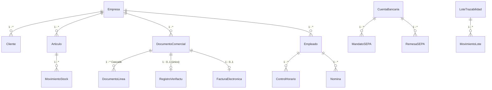

# ERP.NET — Documentación Única

> **Versión:** 1.0 · Septiembre 2026 · Rama única `main` · Stack .NET 9 + Blazor WASM + WPF WebView2 + MAUI + Flutter
> **Objetivo:** ERP completo para PYMES/autónomos en España con cumplimiento legal 2026 (Verifactu, FACe/B2B, IVA/IGIC/IPSI, PGC, SEPA, nóminas SLD, control horario digital, RGPD/eIDAS). Este documento consolida y **sustituye** a `docs/*.md`, `ERP.Desktop/README.md`, `flutter_app/README.md` y `.agent/plans/erp-legal-completo-2026-08-31.md` (eliminados).

---

## 1. Resumen Ejecutivo

| Capa | Proyecto | Rol |
|------|----------|-----|
| Domain | `ERP.Domain` | Entidades, DTOs, `AppPermissions` |
| Data | `ERP.Data` | `ApplicationDbContext.cs:15`, `MasterDbContext`, migraciones EF Core 9.0.19 |
| Services | `ERP.Services` | `CicloFacturacionService`, `VerifactuService`, `FiscalService`, `ContabilidadService`, `BancarioService`, `NominaService`, `ControlHorarioService`, `TenantDatabaseService` |
| API | `ERP.Api` | `Program.cs:17`, `Controllers/*`, `Hubs/DashboardHub`, JWT Bearer, Swagger, SignalR |
| Web | `ERP.Web` | Blazor WASM `ERP.Web.csproj:1`, `Pages/*`, `Layout/NavMenu.razor`, `Services/AuthService.cs` |
| Desktop | `ERP.Desktop` | WPF `net9.0-windows` + WebView2 `1.0.2957.106` (`ERP.Desktop.csproj:1`, `MainWindow.xaml.cs:1`) — shell sin reescribir UI |
| Móvil MAUI | `ERP.Movil` | `ERP.Movil.csproj:1` (`net9.0-android/ios/maccatalyst/windows`), `Pages/*` (Compras, Ventas, RRHH, Stock, Maestros...), `Platforms/*`, `Resources/*` |
| Móvil Flutter | `flutter_app` | `flutter_app/pubspec.yaml:1` (`http ^1.2.2`, `flutter_secure_storage ^9.2.2`, `sdk >=3.5.0`), `lib/main.dart:1`, `lib/core/*`, `android/ios/macos/windows` |

**Build:** `dotnet build ERP_Sistema.sln -c Release` 0 errores (2 warnings `sqlitepclraw` wasm). `flutter analyze` 0 issues (`withValues` migrado). Solución `ERP_Sistema.sln` incluye 8 proyectos.

---

## 2. Arquitectura y Base de Datos

### 2.1 Motor y Multi-tenant
- **ORM:** EF Core 9.0.19 · **Snapshot:** `ERP.Data/Migrations/ApplicationDbContextModelSnapshot.cs:15`
- **Proveedores:** SQLite `Data Source=erp.db` (`ERP.Api/appsettings.json:4`, `erp-fresh.db` en Development) / SQL Server toggle `Database:UseSqlite` (`ERP.Api/Program.cs:22,51`)
- **Multi-tenant:** `erp.db` maestro (todos los `AspNetUsers` duplicados) + clon `Gestion{Empresa}.db` por empresa. Resolución por claim `Tenant` en `ERP.Api/Program.cs:25-41` vía `ERP.Services/Tenant/TenantDatabaseService.cs`. `TenantDatabaseService.cs:184` duplica usuarios en cada `GestionX.db`.
- **Login:** siempre contra `erp.db` sin claim `Tenant`; `AuthController.cs:47,89` resuelve fichero `Gestion{SanitizeEmpresa}.db` para JWT (`AuthController.cs:92`). Sin `Tenant` (pasillo `admin@erp.local` `EmpresaId=0`) usa maestro virgen; `EmpresasController.cs:39` filtra `EmpresaId==0 → []`.
- **Logout virgen:** `AuthService.Logout()` borra `authToken` + `erp_empresas_active_id` + `erp_onboarding_dismissed` + `erp_*` + `sessionStorage` (`ERP.Web/Services/AuthService.cs:88`), `EmpresaService.ClearAsync()` (`ERP.Web/Services/EmpresaService.cs:113`), `NotificationService.ClearHistory()`, navegación `forceLoad:true` destruye circuito Blazor (`Header.razor:130`, `NavMenu.razor:454`).
- **Onboarding virgen:** `OnboardingWizard.razor:124` detecta `OnboardingRequired`/`EmpresaId==0` y fuerza paso 1 vacío.
- **Migración al arranque:** `context.Database.MigrateAsync()` con fallback `EnsureCreatedAsync()` (`ERP.Api/Program.cs:180`).
- **Precisión:** `decimal(18,4)` global (`ERP.Data/ApplicationDbContext.cs:97-107`). **Filtros soft-delete:** `Cliente.IsActivo`, `Articulo.IsDescatalogado`, `Empleado.FechaBaja` (`ApplicationDbContext.cs:88-94`).
- **Seed bootstrap:** `admin@erp.local` / `Admin123!` sin `EmpresaId`, rol `Admin` + `AppPermissions` (`ERP.Api/Program.cs:197-232`).



### 2.2 Identity
`IdentityDbContext<ApplicationUser>` (`ERP.Data/ApplicationDbContext.cs:15`): `AspNetUsers` (`Id`, `UserName` UNIQUE, `Email`, `FullName*`, `EmpresaId` FK→Empresas `Restrict` `ApplicationDbContext.cs:145`), `AspNetRoles`, `AspNetUserClaims` (`Permission`/`AppPermissions.All`), `AspNetUserTokens/Logins`.

### 2.3 Tablas Núcleo (resumen)
**Empresas** (`Empresa.cs:8`, `ApplicationDbContext.cs:22`): `NombreComercial(100)`, `RazonSocial(150)`, `CIF(20)`, `Direccion/CP/Poblacion`, `SerieFacturacion="2026"`, `UltimoNumeroFactura`, `IsActiva`, `ModalidadVerifactu`/`FechaAltaVerifactu`/`CertificadoVerifactuId`, `NombreSistemaInformatico="ERP.NET"`, `TerritorioFiscal` (Península/Canarias/CeutaMelilla), `EsSII`.

**Terceros:** Clientes (`CodigoCliente(20)`, `CIF(20)`, `NIF_UE`, `DIR3_*`, `IsBloqueado`, `TieneRecargoEquivalencia`), Proveedores/Acreedores.

**Catálogo:** Familia (`Nombre(100)`, `ToTable("Familia")` `ApplicationDbContext.cs:94`), Articulos (`Codigo(50)`, `FamiliaId` FK `Restrict` `ApplicationDbContext.cs:151`, `PrecioCompra/Venta`, `StockMinimo`, `PorcentajeIva`).

**Documentos** (`DocumentoComercial.cs:8`, `Documentos` `ApplicationDbContext.cs:31`): `Tipo` enum, `NumeroDocumento(50)` UNIQUE `EmpresaId+NumeroDocumento` (`ApplicationDbContext.cs:176`), `BaseImponible/TotalIva/Total` `decimal(18,4)`, `IncidenciaVerifactu`, `EsFacturaSimplificada`, `EnviadaCliente/PresentadaHacienda`, `Estado` enum. **Líneas** (`DocumentoLinea.cs`) `DocumentoId` Cascade (`ApplicationDbContext.cs:186`), `PorcentajeIva/RecargoEquivalencia/RetencionIRPF` `decimal(5,2)`. **Vencimientos**, **CierresCaja** (`Base4/10/21`, `Iva4/10/21`), **MovimientosStock**.

### 2.4 Módulos Legales (tablas clave)
- **Verifactu:** `RegistrosVerifactu` (`DocumentoId` UNIQUE `ApplicationDbContext.cs:179`), `RegistrosVerifactuAnulacion` (`RegistroAltaId` UNIQUE `ApplicationDbContext.cs:265`), `FacturasElectronicas` (`DocumentoId` UNIQUE `ApplicationDbContext.cs:275`, `XmlBase64`, `FirmaXAdES`, `HashSha256`, `DIR3_*`, `Estado` FACe/B2B).
- **RRHH:** Empleados (`DNI(20)`, `CCC(20)`, `IBAN(34)`, `GrupoCotizacion`, `CNAE`, `PinAcceso`), `ControlesHorarios` (`Entrada/Salida`, `Hash(64)+HashAnterior` cadena inmutable, `Geolocalizacion`, `FirmaEmpleado`), `PoliticasControlHorario` (`EmpresaId` UNIQUE `ApplicationDbContext.cs:261`), `Nominas` (`RemesaSEPAId` `Restrict` `ApplicationDbContext.cs:290`).
- **Contable PGC:** `CuentasContables` (`Codigo TEXT(9)` PK, `Grupo` enum 9 grupos), `AsientosContables`/`ApuntesContables`, `EjerciciosContables`, `LibrosDiario/Mayor/Inventarios` (`HashArchivo(500)`, `FechaLegalizacion`).
- **Bancario SEPA (pain.001/008/camt.053):** `CuentasBancarias` (`IBAN(34)`, `CreditorIdentifier(35)`), `MandatosSEPA` (`RUM(35)`, `Core/B2B`, `BeneficiarioVerificado`), `RemesasSEPA` (`XmlGenerado`, `HashXmlSHA256`, `Estado`), `OperacionesRemesaSEPA`, `ExtractosBancarios`/`MovimientosExtracto`.
- **Trazabilidad:** `LotesTrazabilidad`, `MovimientosLote` (atrás/adelante/transformación `Restrict` `ApplicationDbContext.cs:224-236`), `AlertasTrazabilidad`, `RetiradasLote`.
- **Fiscal:** `ConfiguracionesIVA` (`AplicaIVACaja`, `Prorrata`, `Recargo 5.2/1.4/0.5`, `Regimenes Especiales`), `LiquidacionesIVA` (303/390), `TarifasImpuesto`, `LibrosRegistroIVA`.
- **Firma/RGPD:** `CertificadosDigitales` (`ThumbprintSHA256`, `QTSP`, `CRL/OCSP`), `FirmasElectronicas` (`PAdES/XAdES/CAdES/JAdES`), `SellosTiempo` (RFC3161), `ComunicacionesCertificadas`, `RegistrosTratamiento` (art.30), `LiquidacionesSeguridadSocial`.

**Índices:** `Documentos UNIQUE(EmpresaId,NumeroDocumento)`, `RegistrosVerifactu UNIQUE(DocumentoId)`, `PoliticasControlHorario UNIQUE(EmpresaId)`. FKs `Restrict` (excepto `DocumentoLinea` `Cascade`).

---

## 3. Cumplimiento Legal España 2026

### 3.1 Verifactu — RD 1007/2023 (antifraude)
Base: Art.29.2.j LGT (Ley 11/2021) → RD 1007/2023 (BOE 06-12-2023) → Orden HAC/1177/2024 (hash SHA256 encadenado, QR, firma) → RD 254/2025 → RD-ley 15/2025 (plazos vigentes 31-08-2026): **IS 1-ene-2027, resto 1-jul-2027**, sanción Art.201 bis LGT 50k€/ejercicio (usuario) / 150k€ (fabricante). Modalidades: **VERI*FACTU** (remisión inmediata), **NO VERI*FACTU** (custodia), aplicativo AEAT. Registros: Alta/Anulación/Evento con `HuellaAnterior` (`RegistroVerifactu:44`), QR `https://www2.agenciatributaria.gob.es/wlpl/TIKE-CONT/ValidarQR?...` ya en `VerifactuService.GenerarUrlQr():85`. Implementado: `VerifactuService.cs` (hash encadenado, QR), `RegistroVerifactu`, `Pages/Verifactu.razor`.

### 3.2 Facturación Electrónica
**FACe B2G:** Ley 25/2013 + RD 1619/2012 + Orden HAP/1074/2014, obligatoria 15-01-2015 >5k€, formato **Facturae 3.2.2** XAdES-Enveloped a FACe.gob.es (DIR3 OC/OG/UT). **B2B:** Ley 18/2022 art.12 + proyecto RD 2024 + RD 238/2026 (31-03-2026) + Orden 01-10-2026: grandes >8M€ 12m (01-10-2027), resto 24m (01-10-2028), formatos Facturae/UBL EN16931 vía hub privado + AEAT. Implementado: `Pages/Facturae.razor`, `FacturaeService.cs` (Facturae 3.2.x, XAdES), `FacturaElectronicaView`.

### 3.3 Fiscal IVA/IRPF/IGIC/IPSI
**IVA LIVA 37/1992:** General 21% (`Articulo.PorcentajeIva:29`), Reducido 10%, Superreducido 4% (art.91), Exento art.20, Recargo equivalencia 5,2/1,4/0,5/1,75% (`IVAEntities.ConfiguracionIVA.RecargoGeneral:53`), Prorrata general `Math.Ceiling` (`MotorIVAService:52`) art.102-105, Sectores art.9.1.c, IVA caja art.163 bis (`AplicaIVACaja:69`). Modelos 303 (20-abr/jul/oct, 30-ene), 390, 349 VIES. **IGIC** Ley 20/1991 Canarias (7% general, 0/3/5/9,5/13,5/20%, modelo 420), **IPSI** 0,5-10% Ceuta/Melilla. Península↔Canarias = exportación DUA. Implementado: `Pages/IVA.razor`, `FiscalService.cs`, `ConfiguracionIVA` (`PorcentajeIVA/IGIC/IPSI`), `MotorIVAService`, `IVAEntities.cs`.

### 3.4 Contable PGC y Libros
Código Comercio art.25-33 + PGC RD 1514/2007 + PYMES 1515/2007 + Ley 14/2013 art.18 + Instrucción DGRN 12-02-2015: legalización telemática en Registro Mercantil **4 meses tras cierre** (legamus.registradores.org), depósito Cuentas Anuales **mes siguiente a Junta** (máx 30-jul), sanción cierre registral + 1.200-300k€. Implementado: `Contabilidad/CuentaContable.cs`, `AsientoContable/ApunteContable`, `LibrosOficiales.cs` (`LibroDiario/Mayor/Inventarios`), `ContabilidadService`, `DTOs/ContabilidadDtos.cs`.

### 3.5 Compras/Almacén/Trazabilidad
Reg. CE 178/2002 art.18 + 852/2004 APPCC + 191/2011: un paso atrás/adelante, conservación 5 años, App.ya `TrazabilidadEntities.LoteTrazabilidad`. Implementado: `Pages/Compras/NuevoPedido.razor`, `Pages/Stock/*` (Valoración PMP/FIFO, Kardex), `StockService`, `TrazabilidadService`.

### 3.6 Bancario SEPA
Reg. UE 260/2012 + EPC SCT/SDD + Reg. 2024/886 SCT Inst 10s (9-ene-2025 emisora, 9-oct-2025 receptora) + ISO20022 pain.001.001.03/008.001.02/camt.053 + PSD2 VoP 5-oct-2025 + direcciones estructuradas 22-nov-2026. Implementado: `BancarioService` (IBAN MOD97, `GenerarPain001/008`, `ConciliarAutomatico`), `SepaXmlGeneratorService` (`pain.001.001.03/008.001.02`), `TesoreriaController`.

### 3.7 Nóminas/Seguridad Social
ET 2/2015 art.26-30 + TGSS SLD (CRET@) RLC/RNT vía `RED Direct`/`SILTRA 4.0` (01-06-2026) + Orden PJC/297/2026 (bases 1.847,40-4.909,50€, tipos CC 28,30%, desempleo 7,05%, MEI 0,70%). Implementado: `Pages/RRHH/Nominas.razor`, `NominaService`, `Empleado` (`CCC`, `CNAE`, `GrupoCotizacion`), `Nomina` (`BaseTotal`, `CuotaSegSocialTrabajadorTotal`).

### 3.8 Control Horario Digital
RD-ley 8/2019 (BOE 12-05-2019) art.34.9 ET: registro diario inicio/fin **todos** los trabajadores, conservación 4 años, acceso ITSS, infracción grave 751-7.500€ (LISOS 7.5), proyecto RD digital sep-2026 (sólo digital objetivo/inalterable/trazable, acceso remoto ITSS, 10k€/trabajador, pendiente BOE). Implementado: `ControlHorario.cs` (`EmpleadoId`, `Entrada/Salida`, `Hash(64)+HashAnterior` cadena), `Empleado.PinAcceso`, `ControlHorarioService` (hash encadenado), `PoliticaControlHorario`, `Pages/RRHH/ControlHorario.razor`.

### 3.9 RGPD + Firma Digital eIDAS
RGPD 2016/679 + LOPDGDD 3/2018 + eIDAS 910/2014 + Ley 6/2020: Simple/Avanzada/Cualificada (PAdES/XAdES/CAdES/JAdES ETSI 319), QTSP (FNMT), sello tiempo RFC3161, burofax art.43. Implementado: `FirmaDigitalEntities.cs` (`CertificadoDigital`, `FirmaElectronica`, `SelloTiempo`, `ComunicacionCertificada`), `FirmaDigitalService` (importar, `FirmarDocumentoAsync`, `SellarTiempoAsync`), `RegistroTratamiento` art.30 (`RegistroTratamientoService.cs`).

**Plan de aplicación priorizado (BOE):** Verifactu 2027 > Control horario digital sep-2026 > FACe/B2B 2027-28. Fases B-F detalladas en dossier original (migraciones `AddControlHorarioDigital`, `TarifaImpuesto`, `FacturaElectronica`, `Legalizacion`).

---

## 4. Aplicaciones

### 4.1 Web (`ERP.Web`)
Blazor WASM en `http://localhost:5109`. `Layout/NavMenu.razor:12` + `NavMenu.razor.css`, `Pages/Home.razor` (KPIs), `Pages/Stock/ValoracionAlmacen.razor`, `Pages/RRHH/*`, `Pages/Fiscal/*`, `Pages/Verifactu.razor`, `Pages/Facturae.razor`, `Shared/Components/OnboardingWizard.razor:124` + `SetupWizard.razor`. Auth `Services/AuthService.cs:88` + `CustomAuthenticationProvider.cs` + `EmpresaService.cs:113` + `NotificationService`. `Program.cs:17` CORS `AllowBlazorClient` + `AddScoped<ITenantContext, HttpTenantContext>`.

### 4.2 Desktop (`ERP.Desktop`)
Rama `escritorio` fusionada: WPF `net9.0-windows` + WebView2 `1.0.2957.106` alojando `http://localhost:5109`. `ERP.Api` hace `UseStaticFiles + MapFallbackToFile("index.html")` → mismo puerto. `MainWindow.xaml.cs` comprueba `GET {ApiUrl}` y si falla lanza `dotnet ERP.Api.dll --urls {ApiUrl}` (busca junto al exe o `ERP.Api/bin/Release/net9.0`), al cerrar mata proceso hijo. Hereda logout/onboarding virgen (`wsl`). Ejecutar: `dotnet run --project ERP.Api --urls http://localhost:5109` + `dotnet run --project ERP.Desktop` o `ERP.Desktop.exe`. Publicar: `dotnet publish ERP.Desktop -c Release -r win-x64 --self-contained true -p:PublishSingleFile=true`.

### 4.3 Móvil MAUI (`ERP.Movil`)
`ERP.Movil/ERP.Movil.csproj:1` `net9.0-android/ios/maccatalyst` (+ `windows` si OS Windows). `AppShell.xaml`, `MauiProgram.cs`, `MainPage.xaml`, `Pages/ComprasPage.xaml`, `ConfigPage.xaml`, `DashboardPage.xaml`, `MaestrosPage.xaml`, `RRHHPage.xaml`, `StockPage.xaml`, `VentasPage.xaml`, `Platforms/Android/MainActivity.cs`, `Resources/AppIcon/*`. SingleProject, `UseMaui`, en `ERP_Sistema.sln`.

### 4.4 Móvil Flutter (`flutter_app`)
Sustituye progresivamente a MAUI (conserva `ERP.Movil` intacto). `pubspec.yaml:1` `erp_flutter 1.0.0+1` (`flutter_secure_storage ^9.2.2`, `http ^1.2.2`), `lib/main.dart:1` (`ErpApp` restore token), `lib/core/erp_api.dart` (`AuthService.login` `POST api/auth/login`, `parseJwt`, `ApiClient` `getJson/getList`), `lib/core/erp_navigation.dart` (secciones 1:1 `NavMenu.razor`: Escritorio, General, Ventas, Tesorería, Compras, RRHH, Stock, Maestros, Legal...), `lib/core/erp_theme.dart` (`ErpColors` slate950 `0xFF020617` / slate900 `0xFF0F172A` / blue600 `0xFF2563EB`, `ErpTheme.light()`, `withValues(alpha:)`), `lib/widgets/erp_widgets.dart` (`ErpLogo`, `KpiCard`, `ErpCard`). URL: Android emulado `http://10.0.2.2:5109/`, resto `http://localhost:5109/`, override `--dart-define=ERP_API_BASE_URL=https://servidor/` (`erp_api.dart:7` `apiBaseUrl()`). Ejecución: `flutter pub get && flutter run`. `flutter analyze` 0 issues.

---

## 5. Manual de Usuario (condensado)

### 5.1 Acceso
`http://localhost:5109` → Login `admin@erp.local` / `Admin123!`. JWT Bearer, 6 permisos: Usuarios, Roles, Ver, Editar, Stock, Facturar. Autologout 30 min.

### 5.2 Módulos
**Ventas:** Nueva Venta (TPV), Presupuestos, Albaranes, Listado Documentos (filtros fecha/cliente/estado). **Compras:** Pedidos Proveedores, Recepción (actualiza stock), Listado. **Stock:** Ajustes, Valoración (costo+IVA), Etiquetas QR, Auditoría (usuario/fecha). **RRHH:** Kiosko Fichajes (RDL 8/2019), Empleados, Nóminas (IRPF/SS), Control Horario. **Fiscal:** IVA/IGIC/IPSI (Península/Canarias/Ceuta), Modelo 303 trimestral. **Verifactu:** Alta (hash SHA256 encadenado), Anulación, QR SII. **Facturae:** Facturae 3.2.x, Envío FACe, firma XAdES. **Contable:** Asientos, Libro Diario/Mayor, Legalización RM. **RGPD:** Registro Actividades art.30, DPO, derechos ARSPOPOL. **Tesorería/SEPA:** Remesas `pain.001`, Mandatos, VoP.

### 5.3 Perfiles
Admin (todo), Gestor Fiscal (Ver/Editar/Facturar), Vendedor (Ver/Facturar → TPV), Compras (Ver/Editar), RR.HH., Contable, Tesorero.

### 5.4 Tareas diarias
Vendedor: Nueva Venta → buscar artículo → carrito → descuentos → emitir factura → comprobante. Empleado: RR.HH. → Kiosko → Fichar Entrada/Salida. Fiscal: IVA → 303 trimestral → revisar/corrección → generar AEAT. Facturae: Listado → Enviar a FACe → elegir certificado → acuse. Almacén: Stock → Ajuste → motivo → cantidad real → auditoría.

### 5.5 Configuración inicial
1 Empresa (NIF, régimen), 2 IVA/IGIC/IPSI por ubicación, 3 Artículos, 4 Clientes/Proveedores, 5 Usuarios/Roles, 6 Bancos (IBAN) para SEPA.

### 5.6 Soporte
Logs `Logs/`, backups antes de masivas, firmar con certificado cualificado, auditar stock. Problemas: credenciales→admin, menú no aparece→permiso, FACe falla→certificado caducado, IVA mal→tipo artículo no configurado, SEPA falla→IBAN incompleto.

---

## 6. Convenciones y Reglas de No-Duplicación

- **Pluralidad DbSets:** 95% plural (`Empresas`, `Articulos`). Excepción `Familia` singular (`DbSet<Familia> Familia`, `ToTable("Familia")` `ApplicationDbContext.cs:85`) — mantener, no crear `Familias`. `Acreedor` vs `Proveedor.EsAcreedor` — split ya documentado. `GastoCaja` sin `DbSet` — añadir `GastosCaja` si se usa. `DocumentoComercial` → `Documentos` (no `DocumentosComerciales`).
- Borrar `.bak` (`FirmaDigitalEntities.cs.bak`, `ComprasController.cs.bak`).
- Precisión `decimal(18,4)` global, únicas `Documentos(EmpresaId,NumeroDocumento)`, `RegistroVerifactu(DocumentoId)`.
- Verificación post-cambio: `dotnet build ERP.Data` 0 errores, `dotnet ef migrations add` no debe crear `CreateTable("Familias")` duplicado, flujo `CrearDocumento → RegistroVerifactu` QR válido + `RemesaSEPA` `pain.001` válido EPC.

---

## 7. Estructura de Ficheros

```
ERP.Domain/         - Entities (Bancario/, Contabilidad/, Fiscal/, FirmaDigital/, Trazabilidad/, RGPD/), DTOs
ERP.Data/           - ApplicationDbContext.cs, MasterDbContext.cs, Migrations/*, ITenantContext.cs
ERP.Services/       - Bancario/, Contabilidad/, Trazabilidad/, Fiscal/, FirmaDigital/, Tenant/TenantDatabaseService.cs, SeedService.cs
ERP.Api/            - Controllers/* (Bancario/, Fiscal/, Contabilidad/, Trazabilidad/), Infrastructure/*, Services/EmailService.cs, hubs/DashboardHub.cs
ERP.Web/            - Pages/* (Bancario/, Fiscal/, RRHH/, Stock/, Contabilidad/, Verifactu.razor, Facturae.razor), Layout/, Services/, Shared/Components/
ERP.Desktop/        - App.xaml, MainWindow.xaml(.cs), ERP.Desktop.csproj, ERP.Desktop.json.example
ERP.Movil/          - AppShell.xaml, MauiProgram.cs, Pages/*, Platforms/*, Resources/*
flutter_app/        - lib/main.dart, lib/core/*, lib/widgets/*, android/, ios/, macos/, windows/, test/
ERP_Sistema.sln     - 8 proyectos
start-erp.bat       - dotnet run Api + Web
DOCUMENTACION.md    - este fichero (único)
```

**Fuentes primarias:** BOE-A-2023-24840, BOE-A-2024-22138, BOE-A-2025-6600, BOE 03-12-2025 RDL15/2025, BOE-A-1992-28740, BOE-A-2015-1481, Orden PJC/297/2026 31-03-2026, Reg. UE 260/2012, Reg. 2024/886, ATC IGIC Ley 20/1991, sede AEAT FAQ 26-03-2026.

---
*Fin DOCUMENTACION.md — Para dudas, adjuntar pantalla/error, pasos, datos (cliente/artículo/fecha), navegador y versión.*
