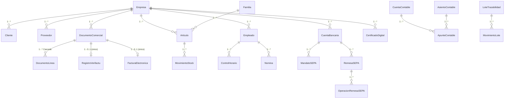

# ERP.NET — Documentación Única

> **Versión:** 1.0 · Septiembre 2026 · Rama única `main` (8c93a2d) · .NET 9 + Blazor WASM + WPF WebView2 + MAUI + Flutter
> **Objetivo:** ERP completo para PYMES/autónomos en España con cumplimiento legal 2026 (Verifactu/antifraude, FACe/B2B, IVA/IGIC/IPSI, PGC, SEPA, nóminas SLD, control horario digital, RGPD/eIDAS).
> **Consolidado de:** `docs/DOSSIER_LEGAL_ERP_2026.md` (283l), `docs/ERP_2026_Legal_Implementation_Documentation.md` (166l), `docs/ESTRUCTURA_BBDD.md` (263l), `docs/Manual_Usuario_ERP.NET.md` (252l), `ERP.Desktop/README.md` (44l), `flutter_app/README.md` (21l), `flutter_app/ios/.../README.md` (5l), `.agent/plans/erp-legal-completo-2026-08-31.md` (138l) — total 1172l → 1 fichero.

---

## Índice
1. [Resumen Ejecutivo y Stack](#1-resumen-ejecutivo-y-stack)
2. [Arquitectura Técnica y Multi-tenant](#2-arquitectura-técnica-y-multi-tenant)
3. [Modelo de Datos Completo (EF Core)](#3-modelo-de-datos-completo-ef-core)
4. [Dossier Legal 2026 — Ciclo Completo España](#4-dossier-legal-2026--ciclo-completo-españa)
5. [Implementación Legal — Módulos y Cambios](#5-implementación-legal--módulos-y-cambios)
6. [Plan de No-Duplicación y Fases](#6-plan-de-no-duplicación-y-fases)
7. [Manual de Usuario Completo](#7-manual-de-usuario-completo)
8. [Apps: Web, Desktop, MAUI y Flutter](#8-apps-web-desktop-maui-y-flutter)
9. [Convenciones, Build y Fuentes](#9-convenciones-build-y-fuentes)

---

## 1. Resumen Ejecutivo y Stack

| Capa | Proyecto | Archivos clave | Rol |
|------|----------|----------------|-----|
| Domain | `ERP.Domain` | `Entities/*`, `DTOs/*`, `Constants/Permissions.cs:1` | Entidades, DTOs, `AppPermissions` |
| Data | `ERP.Data` | `ApplicationDbContext.cs:15`, `MasterDbContext.cs:1`, `Migrations/*` | DbContext + migraciones EF 9.0.19 |
| Services | `ERP.Services` | `CicloFacturacionService.cs:1`, `VerifactuService.cs:1`, `Fiscal/MotorIVAService.cs:1`, `Contabilidad/ContabilidadService.cs:1`, `Bancario/BancarioService.cs:1`, `Trazabilidad/*`, `Tenant/TenantDatabaseService.cs:1` | Lógica de negocio |
| API | `ERP.Api` | `Program.cs:17`, `Controllers/*`, `Hubs/DashboardHub.cs:1`, `Infrastructure/*`, `Services/EmailService.cs:1` | REST + JWT + Swagger + SignalR |
| Web | `ERP.Web` | `ERP.Web.csproj:1`, `Pages/*`, `Layout/NavMenu.razor:12`, `Services/AuthService.cs:88` | Blazor WASM SPA |
| Desktop | `ERP.Desktop` | `ERP.Desktop.csproj:1`, `App.xaml:1`, `MainWindow.xaml.cs:1`, `AssemblyInfo.cs:1` | WPF net9.0-windows + WebView2 `1.0.2957.106` shell |
| Móvil MAUI | `ERP.Movil` | `ERP.Movil.csproj:1` (`net9.0-android/ios/maccatalyst/windows`), `AppShell.xaml:1`, `MauiProgram.cs:1`, `Pages/*` | MAUI SingleProject |
| Móvil Flutter | `flutter_app` | `pubspec.yaml:1`, `lib/main.dart:1`, `lib/core/erp_api.dart:1`, `lib/core/erp_theme.dart:1` | Flutter 3.5+ (`http ^1.2.2`, `flutter_secure_storage ^9.2.2`) |

**Solución:** `ERP_Sistema.sln:1` con 8 proyectos (`ERP.Domain`, `ERP.Data`, `ERP.Services`, `ERP.Api`, `ERP.Web`, `ERP.Services.Tests`, `ERP.Desktop`, `ERP.Movil`). **Build:** `dotnet build ERP_Sistema.sln -c Release` 0 errores (2 warnings `sqlitepclraw.lib.e_sqlite3` wasm). **Flutter:** `flutter analyze` 0 issues tras migración `withOpacity`→`withValues(alpha:)` y fix `unused_element _navigate`.

---

## 2. Arquitectura Técnica y Multi-tenant

### 2.1 Motor
| Aspecto | Detalle |
|---|---|
| **ORM** | EF Core 9.0.19 · Snapshot `ERP.Data/Migrations/ApplicationDbContextModelSnapshot.cs:15` |
| **Migraciones** | `20260903112212_InitialCreate`, `20260903115124_Compliance2026`, `20260910074813_AddSetupTutorialFlags`, `20260910090555_AddEmpresaIdFamiliaProveedorAcreedor`, `20260910114225_AddUserEmpresaMultiTenant`, `20260911082938_AddPerCompanySetupTutorial` |
| **Proveedor ppal** | SQLite `Data Source=erp.db` (`ERP.Api/appsettings.json:4`, `erp-fresh.db` en Development `appsettings.Development.json:10`) |
| **Alternativo** | SQL Server toggle `Database:UseSqlite` (`ERP.Api/Program.cs:22,51`) |
| **Multi-tenant** | `erp.db` maestro (todos los `AspNetUsers` duplicados) + clon `Gestion{Empresa}.db` por empresa. Resolución por claim `Tenant` en `ERP.Api/Program.cs:25-41` vía `ERP.Services/Tenant/TenantDatabaseService.cs`. `TenantDatabaseService.cs:184` duplica usuarios en cada `GestionX.db` |
| **Login** | Siempre contra `erp.db` sin claim `Tenant`; `AuthController.cs:47,89` resuelve fichero `Gestion{SanitizeEmpresa}.db` para JWT (`AuthController.cs:92`) |
| **Aislamiento** | Request con `Tenant` usa su `GestionX.db`; sin `Tenant` (pasillo `admin@erp.local` `EmpresaId=0`) usa maestro virgen. `EmpresasController.cs:39` filtra `EmpresaId==0 → []` |
| **Logout virgen** | `AuthService.Logout()` borra `authToken` + `erp_empresas_active_id` + `erp_onboarding_dismissed` + `erp_*` + `sessionStorage` (`ERP.Web/Services/AuthService.cs:88`), `EmpresaService.ClearAsync()` (`ERP.Web/Services/EmpresaService.cs:113`), `NotificationService.ClearHistory()`, navegación `forceLoad:true` destruye circuito Blazor (`Header.razor:130`, `NavMenu.razor:454`, `OnboardingWizard.razor:220`) |
| **Onboarding virgen** | `OnboardingWizard.razor:124` detecta `OnboardingRequired`/`EmpresaId==0` y fuerza paso 1 vacío sin precargar `primeraEmpresa` |
| **Migración arranque** | `context.Database.MigrateAsync()` con fallback `EnsureCreatedAsync()` (`ERP.Api/Program.cs:180`) |
| **Precisión** | `decimal(18,4)` global (`ERP.Data/ApplicationDbContext.cs:97-107`) |
| **Filtros soft-delete** | `Cliente.IsActivo`, `Articulo.IsDescatalogado`, `Empleado.FechaBaja`, `Proveedor.IsActivo`, `Acreedor.IsActivo`, `Familia.IsActiva` (`ApplicationDbContext.cs:88-94`) |
| **Seed bootstrap** | `admin@erp.local` / `Admin123!` sin `EmpresaId`, rol `Admin` + `AppPermissions.All` (`ERP.Api/Program.cs:197-232`) |



### 2.2 Identity
`IdentityDbContext<ApplicationUser>` (`ERP.Data/ApplicationDbContext.cs:15`):

| Tabla | Clave | Columnas |
|---|---|---|
| **AspNetUsers** (`ApplicationUser`) | `Id` TEXT | `UserName` UNIQUE, `Email`, `PasswordHash`, `FullName*`, `EmpresaId` FK→Empresas `Restrict` (`ApplicationDbContext.cs:145`), `IsActivo`, `UltimoAcceso`, `LockoutEnabled`, `AccessFailedCount`, `SetupTutorialVisto/Completado` (per-UserEmpresa, ver `UserEmpresa.cs:14`) |
| **AspNetRoles** | `Id` TEXT | `Name`, `NormalizedName` |
| **AspNetUserRoles** | `UserId+RoleId` | — |
| **AspNetUserClaims** | `Id` | `ClaimType="Permission"` / `ClaimValue=AppPermissions.All` (`ERP.Api/Program.cs:96-102`) |
| **AspNetRoleClaims, AspNetUserTokens, AspNetUserLogins** | — | Estándar Identity |

---

## 3. Modelo de Datos Completo (EF Core)

> **DbContext:** `ERP.Data/ApplicationDbContext.cs:15` · **Snapshot:** `ApplicationDbContextModelSnapshot.cs:15` · **Regla:** mantener nombres existentes (`Documentos`, `Familia` singular) y extender, no renombrar.

### 3.1 Empresas
`Empresa.cs:8` → `Empresas` (`ApplicationDbContext.cs:22`)

| Columna | Tipo | Notas |
|---|---|---|
| `Id` | INTEGER PK | Identity |
| `NombreComercial` | TEXT(100) Req | |
| `RazonSocial` | TEXT(150) Req | |
| `CIF` | TEXT(20) Req | |
| `Direccion`, `CodigoPostal`, `Poblacion`, `Provincia` | TEXT | |
| `Email`, `Telefono`, `Web` | TEXT | |
| `RegistroMercantil` | TEXT | |
| `LogoUrl`, `LogoBase64`, `ColorHex="#3498db"`, `Eslogan` | TEXT | Visual |
| `SerieFacturacion="2026"` Req, `UltimoNumeroFactura`, `IvaDefecto 21` decimal(18,4) | | Negocio |
| `IsActiva` | INTEGER bool | |
| `ModalidadVerifactu` enum, `FechaAltaVerifactu`, `CertificadoVerifactuId` FK→`CertificadosDigitales` `Restrict` (`ApplicationDbContext.cs:297`) | Veri*Factu RD1007/2023 |
| `NombreSistemaInformatico="ERP.NET"(100)`, `VersionSistemaInformatico="1.0.0"(20)`, `IdSistemaInformatico(100)`, `NumeroInstalacion(20)` | SIF |
| `TerritorioFiscal` enum, `EsSII` bool | IVA territorial |
| `FechaAlta`, `UltimaModificacion` | Auditoría |

### 3.2 Terceros
| Tabla | PK | FK Empresa | Campos clave | Filtro |
|---|---|---|---|---|
| **Clientes** (`Cliente.cs`) | Id | `EmpresaId` | `CodigoCliente(20)` Req, `RazonSocial(150)` Req, `CIF(20)` Req, `NIF_UE(20)`, `PaisISO(2)`, `Direccion/Poblacion/Provincia/CodigoPostal`, `Email/Telefono`, `FormaPago`, `DescuentoFijo` decimal(18,2), `DiaPagoHabitual`, `EsAdministracionPublica`+`DIR3_OficinaContable/OrganoGestor/UnidadTramitadora(20)`, `IsActivo`, `IsBloqueado/MotivoBloqueo`, `TieneRecargoEquivalencia` | `IsActivo` |
| **Proveedores** | Id | — | `RazonSocial(150)` Req, `CIF(20)` Req, `NombreContacto(100)`, `Telefono(20)`, `Email(150)`, `EsAcreedor` bool, `FechaAlta`, `IsActivo` | `IsActivo` |
| **Acreedores** | Id | — | Similar Proveedor + `IsActivo` | `IsActivo` |

### 3.3 Catálogo
| Tabla | PK | FKs | Campos |
|---|---|---|---|
| **Familia** (`Familia.cs`) | Id | — | `Nombre(100)` Req, `CodigoInterno(10)`, `Descripcion(255)`, `IsActiva`, `FechaCreacion/UltimaModificacion`. `ToTable("Familia")` `ApplicationDbContext.cs:94` |
| **Articulos** (`Articulo.cs`) | Id | `FamiliaId` FK→Familia `Restrict` (`ApplicationDbContext.cs:151`), `ProveedorHabitualId`, `EmpresaId` | `Codigo(50)` Req, `Descripcion(200)` Req, `FamiliaId`, `PrecioCompra/Venta` decimal(18,4), `Stock/StockMinimo/StockReservado` decimal(18,4), `PorcentajeIva` decimal(18,2), `IsDescatalogado`, `ImagenUrl` |
| **ConfiguracionesGenerales** | `Clave` TEXT PK | — | `Valor` TEXT Req, `Descripcion`, `UltimaModificacion` |

### 3.4 Documentos Comerciales y Tesorería Documental
**Documentos** `DocumentoComercial.cs:8` → `Documentos` (`ApplicationDbContext.cs:31`)

| Columna | Tipo | Notas |
|---|---|---|
| `Id` | INTEGER PK | |
| `Tipo` | INTEGER enum `TipoDocumento` | Factura, Albarán, Presupuesto, Pedido, Rectificativa... |
| `EsCompra` | bool | false=Venta |
| `NumeroDocumento` | TEXT(50) Req | UNIQUE `EmpresaId+NumeroDocumento` (`ApplicationDbContext.cs:176`) |
| `NumeroAlbaran` | TEXT(100) | |
| `Fecha`, `FechaRecepcion` | TEXT | |
| `EmpresaId` | INTEGER FK | |
| `ClienteId` FK→Clientes `Restrict` (`ApplicationDbContext.cs:163`), `ProveedorId` FK→Proveedores `Restrict` (`ApplicationDbContext.cs:169`), `DocumentoOrigenId` | |
| `BaseImponible`, `TotalIva`, `Total` | decimal(18,4) | |
| `IncidenciaVerifactu`, `EsFacturaSimplificada`, `EsFacturaSinIdentifDestinatario`, `TipoRectificativa(2)` I/S, `FacturasRectificadasJson` | Veri*Factu |
| `EnviadaCliente`, `FechaEnvioCliente`, `PresentadaHacienda`, `FechaPresentacionHacienda`, `EstaEmitidaFormalmente` (NotMapped) | Fiscal |
| `Estado` enum `EstadoDocumento` (Borrador...) | |
| `MetodoPago="Efectivo"`, `Observaciones`, `NotasInternas`, `UsuarioNombre(100)` | |

| Tabla | PK | FK | Campos |
|---|---|---|---|
| **DocumentoLineas** (`DocumentoLinea.cs`) | Id | `DocumentoId` FK→Documentos `Cascade` (`ApplicationDbContext.cs:186`), `ArticuloId` FK `SetNull/Restrict` (`ApplicationDbContext.cs:112`) | `DescripcionArticulo` Req, `Cantidad` decimal(18,4), `PrecioUnitario` decimal(18,4), `PorcentajeIva/RecargoEquivalencia/RetencionIRPF` decimal(5,2), `TipoIvaCatalogo` enum, `CategoriaNombre(100)` |
| **Vencimientos** (`Vencimiento.cs`) | Id | `EmpresaId` FK `NoAction` (`ApplicationDbContext.cs:157`) | `DocumentoId`, `FechaVencimiento`, `Importe`, `Estado`, `MetodoPago` |
| **CierresCaja** (`CierreCaja.cs`) | Id | `EmpresaId` FK `Restrict` (`ApplicationDbContext.cs:192`) | `FechaCierre`, `Terminal(50)` Req, `TotalVentasEfectivo/Tarjeta`, `Base4/10/21`, `Iva4/10/21`, `TotalIva`, `ImporteRealEnCaja` decimal(18,4), `IsProcesado`, `DataUsuariosJson/CategoriasJson`, `Observaciones` |
| **MovimientosStock** | Id | `ArticuloId` FK `Restrict` (`ApplicationDbContext.cs:136`) | `Fecha`, `Tipo`, `Cantidad`, `StockResultante`, `DocumentoOrigen` |

### 3.5 Verifactu y Facturación Electrónica
| Tabla | PK | Índice/FK | Descripción |
|---|---|---|---|
| **RegistrosVerifactu** (`RegistroVerifactu.cs`) | Id | `DocumentoId` **UNIQUE** (`ApplicationDbContext.cs:179`), `EmpresaId+FechaHoraHusoGeneracion` idx (`ApplicationDbContext.cs:184`) | Alta Verifactu: `Hash`, `HuellaAnterior(64)`, `QR` `UrlQr(500)`, `XML`, `EstadoRemision`, `NifEmisor(20)`, `NumeroFactura(60)` |
| **RegistrosVerifactuAnulacion** | Id | `RegistroAltaId` **UNIQUE** FK `Restrict` (`ApplicationDbContext.cs:265`) | Anulación |
| **FacturasElectronicas** (`FacturaElectronica.cs`) | Id | `DocumentoId` **UNIQUE** FK `Restrict` (`ApplicationDbContext.cs:275`), `EmpresaId` FK `Restrict` (`ApplicationDbContext.cs:283`) | `NumeroExpedicion(50)` Req, `Serie(20)` Req, `Formato` enum Facturae 3.2, `Version(10)` Req, `CodMoneda(3)`, `Estado` enum, `PuntoEntrada` FACe/B2B, `DIR3_*`, `NIFCliente(20)`, `XmlBase64`, `FirmaXAdESBase64`, `HashSha256(64)`, `CodigoRegistroFACe` |

Empresa amplía Verifactu: `ModalidadVerifactu`, `IdSistemaInformatico`, `NumeroInstalacion` (`Empresa.cs:54-67`).

### 3.6 RRHH y Control Horario
| Tabla | PK | FK | Campos clave |
|---|---|---|---|
| **Empleados** (`Empleado.cs`) | Id | `EmpresaId` | `Nombre(100)` Req, `Apellidos(100)` Req, `NombreCompleto(150)` Req, `DNI(20)` Req, `NumeroSeguridadSocial` Req, `Naf(12)`, `CCC(20)` Req, `IBAN(34)`, `CNAE(20)`, `GrupoCotizacion` enum, `TipoContrato(20)`, `ConvenioColectivo(50)`, `FechaAlta/Baja/Antiguedad`, `SalarioBrutoAnual/BaseMensual` decimal(18,4), `VacacionesTotales/Disfrutadas`, `PinAcceso(10)` Req |
| **ControlesHorarios** (`ControlHorario.cs`) | Id | `EmpleadoId` FK `Restrict` (`ApplicationDbContext.cs:119`) | `Entrada`, `Salida`, `HorasTotales` decimal(18,4), `TipoRegistro/Modalidad/Estado/Origen` enums, `Geolocalizacion(100)`, `IP(45)`, `Hash(64)+HashAnterior(64)` cadena inmutable, `FirmaEmpleadoBase64`, `MotivoCorreccion(500)` |
| **PoliticasControlHorario** (`PoliticaControlHorario.cs`) | Id | `EmpresaId` **UNIQUE** FK `Restrict` (`ApplicationDbContext.cs:255,261`) | Política por empresa |
| **Nominas** (`Nomina.cs`) | Id | `EmpleadoId` FK `Restrict` (`ApplicationDbContext.cs:127`), `RemesaSEPAId` FK `Restrict` (`ApplicationDbContext.cs:290`) | `Periodo`, `Bruto/Neto`, `IRPF`, `SegSocial`, `BaseTotal`, `CuotaSegSocialTrabajadorTotal`, `TienePagasExtra` |
| **Tareas** (`Tarea.cs`) | Id | — | `Titulo`, `Estado`, `Prioridad` |
| **Llamadas** (`Llamada.cs`) | Id | — | Registro llamadas |

### 3.7 Contabilidad (PGC 2008)
| Tabla | PK | FKs | Notas |
|---|---|---|---|
| **CuentasContables** (`Contabilidad/CuentaContable.cs`) | `Codigo` TEXT(9) PK | `CodigoPadre` self-FK, `EmpresaId` | `Nombre(150)` Req, `Descripcion(500)`, `Nivel`, `Grupo` enum 9 grupos, `Naturaleza` Deudora/Acreedora, `EsDetalle`, `EsPGCOficial`, `Activa` |
| **AsientosContables** (`Contabilidad/AsientoContable.cs`) | Id | `EmpresaId`, `LibroDiarioId` nullable | `Numero`, `Serie(20)` Req, `Fecha`, `Concepto(500)` Req, `Tipo`/`Estado` enums, `TotalDebe/Haber` decimal(18,4), `OrigenTipo/OrigenId` polimórfico |
| **ApuntesContables** | Id | `AsientoId` FK, `CuentaContableCodigo` FK(9) | `Concepto(500)`, `Importe` decimal(18,4), `Tipo` Debe/Haber |
| **EjerciciosContables** | Id | `EmpresaId` | `Codigo(10)` Req, `FechaInicio/Fin`, `Estado` enum, `CierreTrimestral1-4`, `LibrosLegalizados/FechaLegalizacion` |
| **LibrosDiario** (`Contabilidad/LibrosOficiales.cs`) | Id | `EjercicioId`, `EmpresaId` | `NumeroLibro(30)` Req, `FechaDesde/Hasta/Generacion`, `TotalDebe/Haber` decimal(18,4), `Estado`, `HashArchivo(500)`, `FirmaXAdESBase64`, `FechaLegalizacion` |
| **LibrosMayor** | Id | `EjercicioId`, `EmpresaId`, `CuentaContableCodigo(9)` | `SaldoInicialDebe/Haber`, `TotalDebe/Haber`, `SaldoFinalDebe/Haber` decimal(18,4) |
| **LibrosInventariosCuentasAnuales** | Id | `EjercicioId`, `EmpresaId` | `BalanceInicial`, `CuentaPerdidasGanancias`, `Memoria`, `BalancesComprobacionTrimestrales` (JSON), `EsAbreviado` |

### 3.8 Bancario/SEPA (pain.001/pain.008/camt.053)
| Tabla | PK | FKs | Campos |
|---|---|---|---|
| **CuentasBancarias** (`Bancario/CuentaBancaria.cs`) | Id | `EmpresaId` | `NombreCuenta(100)` Req, `IBAN(34)` Req, `BIC(11)`, `CreditorIdentifier(35)`, `Tipo` enum, `PermiteAdeudosSEPA/TransferenciasSEPA/Instant`, `LimiteDiarioAdeudos/Transferencias` decimal(18,2) |
| **MandatosSEPA** (`Bancario/MandatoSEPA.cs`) | Id | `EmpresaId`, `ClienteId`/`ProveedorId` nullable, `CuentaBancariaAcreedorId` `Restrict` (`ApplicationDbContext.cs:199`), `CuentaBancariaDeudorId` `Restrict` (`ApplicationDbContext.cs:205`) | `RUM(35)` Req, `Esquema` CORE/B2B/COR1, `TipoSecuencia` FRST/RCUR/FNAL/OOFF, `CreditorIdentifier(35)` Req, `AcreedorNombre(140)`/`IBAN(34)`, `DeudorNombre(140)`/`IBAN(34)`, `BeneficiarioVerificado/FechaVerificacion` |
| **RemesasSEPA** (`Bancario/RemesaSEPA.cs`) | Id | `EmpresaId`, `CuentaBancariaOrdenanteId` `Restrict` (`ApplicationDbContext.cs:212`), `CuentaBancariaAcreedoraId` `Restrict` (`ApplicationDbContext.cs:218`), `MandatoSEPAId` nullable | `Referencia(20)` Req, `Tipo` (Adeudos/Transferencias), `Estado` enum, `ImporteTotal` decimal(18,2), `XmlGenerado` TEXT, `HashXmlSHA256`, `Conciliada` |
| **OperacionesRemesaSEPA** | Id | `RemesaId` FK, `MandatoId` FK nullable | `Importe` decimal(18,2), `Moneda(3)` Req, `Concepto(140)`, `BeneficiarioNombre(140)/IBAN(34)/BIC(11)`, `ReferenciaUnicaMandato(35)`, `OrigenTipo/OrigenId` (Factura/Nómina) |
| **ExtractosBancarios** | Id | `CuentaBancariaId` FK | `ReferenciaExtracto(35)` Req, `SaldoInicial/Final` decimal(18,2), `camt.053` `XmlOriginal`, `HashXmlSHA256` |
| **MovimientosExtracto** | Id | `ExtractoId` FK | `Importe` decimal(18,2), `Tipo` enum, `ContrapartidaNombre(140)/IBAN(34)`, `EndToEndId(35)`, `OperacionRemesaId`, `FacturaId`, `AsientoContableId` |

### 3.9 Trazabilidad Alimentaria
`Trazabilidad/TrazabilidadEntities.cs` → `ApplicationDbContext.cs:61-65`

| Tabla | PK | FKs | Campos |
|---|---|---|---|
| **LotesTrazabilidad** | Id | `EmpresaId`, `ArticuloId` | `CodigoLote`, `FechaFabricacion/Caducidad`, `Cantidad`, `Estado` |
| **MovimientosLote** | Id | `LoteId` FK `MovimientosEntrada` `Restrict` (`ApplicationDbContext.cs:224`), `LoteOrigenId` `Restrict` (`ApplicationDbContext.cs:230`), `LoteResultadoId` `Restrict` (`ApplicationDbContext.cs:236`) | Atrás/adelante, transformaciones |
| **AlertasTrazabilidad** | Id | `LoteId` FK `Restrict` (`ApplicationDbContext.cs:242`) | `Tipo`, `Gravedad`, `Mensaje` |
| **RetiradasLote** | Id | `LoteId` FK `Restrict` (`ApplicationDbContext.cs:248`) | Retirada mercado |

### 3.10 Fiscal IVA / IGIC / IPSI
`Fiscal/IVAEntities.cs` + `TarifaImpuesto.cs` → `ApplicationDbContext.cs:67-72`

| Tabla | PK | FKs | Campos |
|---|---|---|---|
| **ConfiguracionesIVA** | Id | `EmpresaId`, `EjercicioId` | `AplicaIVACaja/FechaInicio/Fin`, `AplicaProrrataGeneral/Especial`, `PorcentajeProrrataGeneral(5,2)`, `TieneSectoresDiferenciados/SectoresJson`, `SujetoRecargoEquivalencia` `RecargoGeneral/Reducido/Superreducido/Tabaco` decimal(5,2), `RegimenBienesUsados/AgenciasViajes/ObjetosArte/OroInversion`, `InversionSujetoPasivoHabitual`, `VersionConfig(20)`, `PorcentajeIVA(5,2)=21`, `PorcentajeIGIC=7`, `PorcentajeIPSI=0,5` |
| **LiquidacionesIVA** | Id | `EmpresaId`, `EjercicioId` | `Año`, `Periodo` T1-T4/M01-M12, `BaseGeneral/Reducida/Exenta/NoSujeta/InversionSujetoPasivo` decimal(18,2), `Cuota*`, `Modelo` 303/390 |
| **DetallesLiquidacionIVA** | Id | `LiquidacionIVAId` FK, `SectorDiferenciadoIVAId` nullable | `BaseImponible` decimal(18,2), `TipoImpositivo` decimal(5,2), `EsDeducible` |
| **LibrosRegistroIVA** | Id | `EmpresaId`, `EjercicioId` | `TipoLibro` Emitidas/Recibidas/BienesInversión/Intracomunitarias, `NIFContraparte`, `BaseImponible`, `CuotaIVA/Recargo`, `ClaveOperacion` |

### 3.11 Firma Digital, Sellado y RGPD
`FirmaDigital/FirmaDigitalEntities.cs` + `RGPD/RegistroTratamiento.cs` → `ApplicationDbContext.cs:74-81`

| Tabla | PK | FK | Campos |
|---|---|---|---|
| **CertificadosDigitales** | Id | `EmpresaId` | `Nombre(100)` Req, `Tipo/Uso/Almacenamiento/Estado` enums, `SubjectDN/IssuerDN(200)` Req, `SerialNumber(40)` Req, `ThumbprintSHA256(64)` Req, `NotBefore/After`, `PublicKeyPem` Req, `CRLUrl/OCSPUrl(200)`, `QTSP(100)`, `NumeroAutorizacionQTSP(100)`, `PoliticaFirmaOID(100)` |
| **FirmasElectronicas** | Id | `EmpresaId`, `CertificadoId` FK | `DocumentoTipo(100)` Req, `Tipo/Formato/EstadoVerificacion` enums, `FirmanteNombre(200)`/`NIF(20)` Req, `FirmaBase64` Req, `HashDocumentoSHA256(64)` Req, `FirmaEstructurada` Req, `FechaFirma`, `DireccionIP(45)`, `TSPUrl(200)` |
| **SolicitudesFirma** | Id | `EmpresaId`, `FirmaElectronicaId` nullable | `Referencia(100)` Req, `Titulo(200)` Req, `DocumentoBase64` Req, `FirmantesJson` Req, `Estado`, `FechaExpiracion` |
| **SellosTiempo** | Id | `EmpresaId` | `TSAName(100)` Req, `TSAUrl(200)` Req, `HashDatosSHA256(64)` Req, `TokenBase64` Req, `FechaTimestamp` |
| **ComunicacionesCertificadas** | Id | `EmpresaId` | `Referencia(100)` Req, `Asunto(200)` Req, `DestinatariosJson` Req, `PruebaEntrega/Contenido` Base64 |
| **RegistrosTratamiento** (RGPD art.30) | Id | `EmpresaId` | `Nombre`, `Finalidad`, `BaseJuridica`, `CategoriasInteresados/Datos`, `Destinatarios`, `PlazoConservacion`, `MedidasSeguridad` |

### 3.12 Índices y Ficheros Fuente
- `Documentos` UNIQUE(`EmpresaId`,`NumeroDocumento`) (`ApplicationDbContext.cs:176`)
- `RegistrosVerifactu` UNIQUE(`DocumentoId`) (`ApplicationDbContext.cs:180`), INDEX(`EmpresaId`,`FechaHoraHusoGeneracion`) (`ApplicationDbContext.cs:184`)
- `RegistrosVerifactuAnulacion` UNIQUE(`RegistroAltaId`) (`ApplicationDbContext.cs:271`)
- `FacturasElectronicas` UNIQUE(`DocumentoId`) (`ApplicationDbContext.cs:281`)
- `PoliticasControlHorario` UNIQUE(`EmpresaId`) (`ApplicationDbContext.cs:261`)
- FKs `Restrict` (excepto `DocumentoLinea`→`Documento` `Cascade`).
- Fuentes: `ERP.Data/ApplicationDbContext.cs`, `ApplicationDbContextModelSnapshot.cs`, `ERP.Domain/Entities/*.cs`, `ERP.Api/Program.cs`, `ERP.Api/appsettings*.json` (`ConnectionStrings:DefaultConnection`).

---

## 4. Dossier Legal 2026 — Ciclo Completo España

> Recopilación normativa vigente a 31-08-2026 (verificar BOE antes de producción). Mapeo previo para no duplicar: `DocumentoComercial` (DocumentoLinea, Vencimiento, CierreCaja), `RegistroVerifactu` (Huella sha256), `Fiscal/IVAEntities.cs` (ConfiguracionIVA, LiquidacionIVA), `Contabilidad` (Asiento/Apunte, LibrosOficiales), `Bancario` (CuentaBancaria, MandatoSEPA, RemesaSEPA, SepaXmlGenerator `pain.001.001.03/008.001.02`), `Empleado`/`ControlHorario`/`Nomina`, `FirmaDigitalEntities` (PAdES/XAdES/CAdES/JAdES), `Trazabilidad`.

### 4.1 Verifactu — Antifraude (inmune a duplicados)
**Base:** Art.29.2.j LGT (Ley 58/2003, Ley 11/2021) → RD 1007/2023 (RRSIF, BOE 06-12-2023, BOE-A-2023-24840) → Orden HAC/1177/2024 (28-10-2024, hash SHA256, QR, declaración responsable) → RD 254/2025 (BOE-A-2025-6600) aplaza a 01-01-2026/01-07-2026 → RD-ley 15/2025 (03-12-2025, DF1ª modifica DF4ª) plazos vigentes **IS 01-01-2027, resto 01-07-2027**, sanción Art.201 bis LGT 50k€/ejercicio (hasta 150k€ doble contabilidad), fabricante 150k€. Antes periodo pruebas no sancionable.

**Modalidades (art.7,8.2,14.2,15,16):** 1) VERI*FACTU (remisión automática inmediata + QR + leyenda), 2) NO VERI*FACTU (custodia con huella+firma, remisión a requerimiento), 3) Aplicativo AEAT gratuito. Opción tácita al iniciar remisión, vincula hasta 31-dic, cambio NO→VERI libre, inverso bloqueado hasta 31-dic. TicketBAI foral excluido.

**Registros:** Alta (`RegistroVerifactu.cs:7`): NIF emisor, serie-número, fecha dd-MM-yyyy, tipo F1/F2/R1-R5 art.10, cuota/total, huella anterior, fecha-hora-huso ISO8601, huella SHA256 = hash(IDEmisor&NumSerie&Fecha&Tipo&Cuota&Importe&HuellaAnterior&FechaHuso), firma opcional, ID sistema. Anulación (no modelado aún) + Eventos (inicio/fin/incidencias). **Requisitos SIF:** inalterabilidad 4 años tributaria/6 mercantil, trazabilidad `HuellaAnterior:44` + declaración responsable (no homologación), QR `https://www2.agenciatributaria.gob.es/wlpl/TIKE-CONT/ValidarQR?nif=...&numserie=...&fecha=...&importe=...` ya en `VerifactuService.GenerarUrlQr():85`.

**Gaps Verifactu:**
- [ ] Entidad `RegistroVerifactuAnulacion` + `TipoOperacionRegistroVerifactu` (Alta/Anulación/Evento)
- [ ] Campos: `Incidencia` S/N, `RechazoPrevio` S/N+motivo, `RefExterna`, `NombreRazonEmisor`, `IdSistemaInformatico` (nombre+versión+ID fabricante), `NumeroInstalacion`, `TipoHuella` 01 SHA256
- [ ] `VerifactuService` anulación, reenvío backoff, validación rechazo AEAT
- [ ] `Empresa` añadir `NIF` validado, `CertificadoVerifactuId` FK, `ModalidadVerifactu`, `FechaAltaVerifactu`
- [ ] `DocumentoComercial` añadir `IncidenciaVerifactu`, `EsFacturaSimplificada`, `EsFacturaSinIdentifDestinatario` (art.6.1.d ROF)

### 4.2 Facturación Electrónica B2G/B2B
**FACe (B2G):** Ley 25/2013 + RD 1619/2012 ROF + Orden HAP/1074/2014, obligatoria 15-ene-2015 >5k€, formato **Facturae 3.2/3.2.2** XAdES-Enveloped a FACe.gob.es (FACE + FACeB2B + eFACT), estados Registrada→En trámite→Aceptada/Rechazada/Pagada (art.9), pago 30 días (Ley 3/2004), DIR3 OC/OG/UT obligatorio.

**B2B:** Ley 18/2022 art.12 + RD 238/2026 (31-03-2026) + Orden 01-10-2026: >8M€ 12m→01-10-2027, resto 24m→01-10-2028 (vinculado a Verifactu público). Formatos Facturae 3.2.x / EN16931 UBL/CEFACT (PEPPOL BIS Billing 3.0) vía plataformas privadas + hub AEAT. Contenido mínimo ROF art.6 + estado pago a observatorio morosidad. Compatibilidad: mismo XML Verifactu/B2B (`DocumentoComercial.NumeroDocumento:20`).

**Gaps B2B:**
- [ ] Entidad `FacturaElectronica` (Id, DocumentoId FK único, Formato Facturae/UBL, XmlBase64, Hash, FirmaXAdES, EstadoFACe/B2B, DIR3, PuntoEntrada FACe/Privado/AEAT, `CodigoRegistroFACe`)
- [ ] `Cliente`/`Proveedor` → DIR3 separados, `NIF_UE` VIES, `EsAdministracionPublica` bool
- [ ] Servicio `FacturaeService` (generar 3.2.2, firmar XAdES con `CertificadoDigital`, validar XSD, enviar SOAP, polling estados)

### 4.3 Fiscalidad — IVA/IRPF/IGIC/IPSI
**IVA LIVA 37/1992 (BOE-A-1992-28740) + RD 1624/1992 RIVA:**
- Tipos: 21% general art.90 (default `Articulo.PorcentajeIva:29`), 10% reducido art.91.Uno, 4% superreducido art.91.Dos (pan, leche, queso, huevos, fruta sin transformar, libros, medicamentos, VPO 1ª), 0% temporal RD-ley 20/2022 (aceite oliva 4% permanente desde 2026), Exento art.20 (sanidad, educación, seguros), No sujeto art.7. SII grandes 4 días (opcional pymes).
- Recargo equivalencia art.148-163: PF/CB minorista consumidor final, tipos 5,2% sobre 21%, 1,4% sobre 10%, 0,5% sobre 4%, 1,75% tabaco (`IVAEntities.ConfiguracionIVA.RecargoGeneral:53=5.2`).
- Prorrata general art.102-103 `Math.Ceiling` (`MotorIVAService:52`), especial art.104-105, Sectores art.9.1.c (`SectorDiferenciadoIVA`), Regímenes especiales 134-163 (`ConfiguracionIVA:62-66`), IVA caja art.163 bis (`AplicaIVACaja:69`), Inversión sujeto pasivo art.84.Uno.2º (`InversionSujetoPasivoHabitual:76`). Modelos 303 trimestral (20-abr/jul/oct, 30-ene), 390 anual, 349 VIES, 347 >3.005,06€, 111/115 IRPF. `LiquidacionIVA` ya genera 303; falta 390/349.

**IRPF:** Ley 35/2006 + RD 439/2007, retención 15% general/7% primer año/19% capital/1% módulos → `DocumentoLinea.PorcentajeRetencionIRPF`.

**IGIC/IPSI:** Ley 20/1991 Canarias (0% básicos, 3% transporte/hostelería, 5% vivienda, 7% general, 9,5% incrementado, 13,5%/15% especial, 20% tabaco rubio, 1% petróleo 2026, modelo 420), Ceuta/Melilla IPSI 0,5-10%. Península↔Canarias = exportación DUA. `Empresa`/`Articulo` necesita `TerritorioFiscal` (IVA/IGIC/IPSI), `DocumentoComercial` no mezcla IGIC+IVA. SII grandes >6M€/REDEME/grupos 4 días (flag `Empresa.EsSII`), Intracomunitaria VIES modelo 349.

**Gaps Fiscal:**
- [ ] `Articulo.PorcentajeIva` → enum `TipoIVA:346` + tabla `TarifaImpuesto` por `TerritorioFiscal`
- [ ] `DocumentoLinea` + `PorcentajeRecargoEquivalencia`, `PorcentajeRetencionIRPF`
- [ ] Entidades `LibroRegistroIVA` (soportado/repercutido), `Modelo390/349`; servicio `LibroIVAService`
- [ ] `MotorIVAService` IGIC 420 y regularización prorrata anual art.107

### 4.4 Contable — PGC, Libros, Depósito
Código Comercio art.25-33 + PGC 1514/2007 + PYMES 1515/2007 + Ley 14/2013 art.18 + Instrucción DGRN 12-02-2015 (BOE-A-2015-1481) + RRM 329-335: legalización telemática en Registro Mercantil domicilio **4 meses tras cierre** (legamus.registradores.org), depósito Cuentas Anuales **mes siguiente a Junta** (máx 30-jul si cierre dic), sanción cierre registral + ICAC 1.200-60k€ (hasta 300k si >60k capital) art.283 LSC, auditoría LAC 22/2015 (activo >2,85M o negocios >5,7M o empleados >50, 2 de 3 dos ejercicios).

Estado: `AsientoContable.cs:12` (Debe=Haber, Serie/Numero), `CuentaContable.cs:12` (PGC 9 grupos), `LibrosOficiales.cs:12` (Diario/Mayor/Inventarios, Hash, Legalización) ya cubre. **Gaps:** `AsientoContable` añadir `EsLegalizado`+`HashSHA256`+`FicheroLegalizadoBase64` para descarga Registradores, servicio `LegalizacionService` (XML Legalia), `Empresa.RegistroMercantil` estructurar `Tomo/Libro/Hoja`, seeding PGC 8 dígitos.

### 4.5 Compras/Almacén/Logística/Trazabilidad
Reg. CE 178/2002 art.18 + 852/2004 APPCC + 191/2011: un paso atrás/adelante 5 años, `TrazabilidadEntities.LoteTrazabilidad` ya cubre + RASFF/AESAN `RetiradaLote` clase I/II/III + Factura compras ROF art.6 + Verifactu + Stock PGC norma 10ª FIFO/PMP + ADR. **Gaps:** `Articulo` añadir `CodigoBarras` EAN13, `UnidadMedida`, `PesoNeto`, `LotesObligatorios`, `FichaAPPCC`; `Proveedor` `Homologado`+`CertificadoCalidad` ISO22000/BRC.

### 4.6 Bancario/SEPA
Reg. UE 260/2012 + EPC SCT/SDD 2025 + Reg. 2024/886 SCT Inst 10s (9-ene-2025 emisora, 9-oct-2025 receptora) + ISO20022 pain.001.001.03/pain.008.001.02/camt.053/pain.002 + PSD2 VoP 5-oct-2025 (Reg. 2024/886 art.5c) + direcciones estructuradas 22-nov-2026 EPC híbridas. Ya `SepaXmlGeneratorService:18-19` genera exactamente esos + `MandatoSEPA.BeneficiarioVerificado`. **Gaps:** `RemesaSEPA.FechaDisponibilidadFondos` + validación VoP previa a `GenerarPain001`, completar catálogo `OperacionRemesaSEPA.CodigoDevolucion` (AM04, MD01...).

### 4.7 Nóminas/Seguridad Social
ET 2/2015 art.26-30 + TGSS SLD CRET@ RLC/RNT (ex-TC1/TC2) vía `RED Direct` (<15) o `SILTRA` v4.0.0 01-06-2026 + Orden PJC/297/2026 30-mar (BOE 31-03-2026, bases 1.847,40-4.909,50€, tipos CC 28,30%, desempleo 7,05%, FOGASA 0,20, FP 0,70, MEI 0,70, AT/EP según CNAE, solidaridad 2025+), plazo último día mes siguiente, IRPF 111+190. `Nomina.cs:6` mínimo + `Empleado.IBAN` ya, falta desglose. **Gaps:** `Nomina` desglosar `BaseCC`, `BaseAT_EP`, `BaseHorasExtra`, `TipoIRPF`, `CuotaSS_Trabajador`, `ProrrataPagasExtra`, `CategoriaProfesional`, `GrupoTarifa`, `CCC`; `Empleado` `GrupoCotizacion` 1-11, `ConvenioColectivo`, `TipoContrato`, `CNAE`, `NAF`; servicio `SiltraService` (XML RLC/RNT, pain.001 nóminas), entidad `LiquidacionSeguridadSocial`.

### 4.8 Control Horario Digital
RD-ley 8/2019 (12-may-2019) art.34.9 ET: registro diario inicio/fin **todos** los trabajadores (completa/parcial, presencial/teletrabajo/móviles), conservación 4 años, acceso ITSS, sanción LISOS 7.5 grave 751-7.500€ (propuesta nueva 10k€/trabajador), proyecto RD digital sep-2026 (solo digital objetivo, fiable, inalterable, trazable con IP/historial, modalidad presencial/teletrabajo, acceso remoto ITSS, pendiente BOE 31-08-2026). `ControlHorario.cs:6` (`Entrada/Salida/Ubicacion/TotalHoras`) + `Empleado.PinAcceso` cubre mínimo. **Gaps:** `ControlHorario` añadir `TipoRegistro` (Entrada/Salida/PausaInicio/PausaFin), `Modalidad` Presencial/Teletrabajo, `Origen` Web/Móvil/Terminal, `IP`, `Geolocalizacion`, `DispositivoId`, `HashEncadenado`, `FirmaEmpleado`, `Estado` Valido/Corregido, `MotivoCorreccion`; entidad `PoliticaControlHorario` (RequiereGeoloc, MargenTolerancia); servicio `ControlHorarioService` append-only SHA256 + export 4 años.

### 4.9 RGPD y Firma Digital
RGPD 2016/679 + LOPDGDD 3/2018 (licitud, minimización, DPIA, registro art.30, brechas 72h, ARSPOPOL, biometría art.9) + eIDAS 910/2014 + Ley 6/2020 + EN 319 122/132/142: Simple/Avanzada/Cualificada+QSCD (equivalente manuscrita art.25.2), PAdES/XAdES/CAdES/JAdES ya `FirmaDigitalService`, QTSP EUTL (FNMT), sello tiempo RFC3161 (`SelloTiempo` con TSAUrl), burofax art.43 (`ComunicacionCertificada`). **Gaps:** entidad `RegistroTratamientoRGPD` (Responsable, Finalidad, Base jurídica, Plazo, Medidas, EIPD bool), consentimiento `Empleado` timestamp + DPIA.

### 4.10 Síntesis Plan (orden BOE)
Verifactu (2027) > Control horario digital (sep 2026) > Factura B2B (2027-28). **Fase A sep-2026:** extender `ControlHorario` + servicio inalterable + `PoliticaControlHorario`, migración `AddControlHorarioDigital`. **Fase B Q4 2026:** `RegistroVerifactuAnulacion`, ampliar `RegistroVerifactu`, `VerifactuService` completo, `Empresa.ModalidadVerifactu`. **Fase C Q4 2026:** `TarifaImpuesto`+`TerritorioFiscal`, `DocumentoLinea.Recargo/IRPF`, `Modelo390/349Service`, `MotorIVAService` IGIC 420. **Fase D Q1 2027:** `FacturaElectronica` + `FacturaeService` (XAdES, FACe SOAP, hub B2B). **Fase E Q1 2027:** `GenerarFicheroLegalia` (hash LibroDiario 4 meses). **Fase F Q2 2027:** desglose `Nomina` + `LiquidacionSeguridadSocial` + pain.001. Validación: migración EF + test `ERP.Services.Tests` (`FacturacionWorkflowTests.cs`, `CierreCajaSecurityTests.cs`) y conservar índices únicos (`DocumentoComercial: NumeroDocumento`, `RegistroVerifactu: DocumentoId`). Fuentes: BOE-A-2023-24840, BOE-A-2024-22138, BOE-A-2025-6600, BOE 03-12-2025 RDL15/2025, BOE-A-1992-28740, BOE-A-2015-1481, Orden PJC/297/2026, Reg. UE 260/2012, Reg. 2024/886, ATC IGIC.

---

## 5. Implementación Legal — Módulos y Cambios

### 5.1 Resumen Implementado (2026-09-09)
Objetivo: ciclo legal completo (Verifactu, FACe/B2B, IVA/IGIC/IPSI, PGC, control horario, nóminas SLD SEPA, RGPD). .NET 9, capas Domain/Data/Services/Api/Web, Web compila 0 errores.

| Módulo | Página | Features | Servicio | Entidad |
|---|---|---|---|---|
| Verifactu RD1007/2023 | `Pages/Verifactu.razor` | Alta SHA256 encadenado, hash verification, política control horario | `VerifactuService.cs` | `RegistroVerifactu` (`EstadoRemision` bool nuevo) |
| Facturae FACe/B2B | `Pages/Facturae.razor` | Envío FACe, B2B hub, modalidad Verifactu (SII/directa), territorio fiscal | `FacturaeService.cs` | `FacturaElectronicaView` |
| Fiscal IVA | `Pages/IVA.razor` | Tarifas 21/10/4, IGIC 7/3/0/9.5/13.5/20%, IPSI 0.5/10%, liquidaciones 303/390 | `FiscalService.cs` | `ConfiguracionIVA` (+`PorcentajeIVA=21`, `PorcentajeIGIC=7`, `PorcentajeIPSI=0.5`, `MargenError=0`) |
| Control Horario RDL8/2019 | `Pages/RRHH/ControlHorario.razor` | Fichaje SHA256, política por empresa, 4 años, validación | `ControlHorarioService.cs`, `PoliticaControlHorarioService.cs` | `PoliticaControlHorario` FK Empresa UNIQUE |
| Nóminas SLD SEPA 2026 | `Pages/Nominas.razor` | Listado desglose bases/IRPF, remesas SEPA, vinculación | — | `Nomina` (+`BaseTotal`, `CuotaSegSocialTrabajadorTotal`, `TienePagasExtra`/`Importe`/`Numero`), `Empleado` (+`NombreCompleto`, `CCC`) |
| RGPD art.30 | `Pages/RGPD/Tratamientos.razor` | Registro actividades, DPO, EIPD | `RegistroTratamientoService.cs` | `RegistroTratamiento` |

### 5.2 Cambios de Entidades
- `Empleado.cs`: `NombreCompleto(150)`, `CCC(20)`.
- `Nomina.cs`: `BaseTotal` decimal(18,4), `CuotaSegSocialTrabajadorTotal` decimal(18,4), `TienePagasExtra` bool, `ImportePagasExtra` decimal, `NumeroPagasExtra` int; existentes `TipoIRPF(5,2)`, `RetencionIRPF`, `TotalNeto` calculado.
- `RegistroVerifactu.cs`: `EstadoRemision` bool.
- `IVAEntities.cs:ConfiguracionIVA`: `PorcentajeIVA(5,2)=21`, `PorcentajeIGIC=7`, `PorcentajeIPSI=0.5`, `MargenError=0`; existentes `AplicaProrrataGeneral`, `RecargoGeneral`, `IVACaja`, etc.

### 5.3 Servicios Nuevos
| Servicio | Namespace | Propósito |
|---|---|---|
| `FiscalService.cs` | `ERP.Services` | IVA/IGIC/IPSI configuraciones y lookups |
| `PoliticaControlHorarioService.cs` | `ERP.Services` | Políticas control horario por empresa |
| `RegistroTratamientoService.cs` | `ERP.Services` | CRUD RGPD art.30 |

### 5.4 Razor Fixes
`@using ERP.Services` añadido en 6 páginas: `Pages/Facturae.razor`, `Pages/IVA.razor`, `Pages/Nominas.razor`, `Pages/Verifactu.razor`, `Pages/RRHH/ControlHorario.razor`, `Pages/RGPD/Tratamientos.razor` ✅

### 5.5 Estructura y Build
```
ERP.Domain/  - Entities (Empleado, Nomina, RegistroVerifactu, ConfiguracionIVA), DTOs
ERP.Data/    - DbContext, Migrations, ITenantContext
ERP.Services/- Bancario/, Contabilidad/, Fiscal/, Trazabilidad/, Tenant/TenantDatabaseService.cs
ERP.Api/     - Controllers/*, Infrastructure/*, hubs/DashboardHub.cs
ERP.Web/     - Pages/*, Layout/, Services/
```
Build: `ERP.Web` 0 errores (warnings CS8603, CS0472 no funcionales), `ERP.Domain`/`ERP.Api`/`ERP.Data` compilan. `ERP.Services` 16 errores `ConfiguracionIVA` (persistente disco, propiedades ya en entidad). Próximos pasos opcionales: añadir 4 propiedades a `IVAEntities.cs` en disco, `dotnet ef database update`, `start-erp.bat` (lanza Api+Web), firma eIDAS 910/2014.

### 5.6 Ficheros Modificados (resumen)
`ERP.Web.csproj`, 6 páginas, `Empleado.cs`, `Nomina.cs`, `RegistroVerifactu.cs`, `IVAEntities.cs`, 3 servicios nuevos, `FacturaElectronicaView`, `start-erp.bat`.

---

## 6. Plan de No-Duplicación y Fases

> Inventario base `ERP.Domain/Entities`, `ERP.Data/ApplicationDbContext.cs:21-72`, `ERP.Services`, `ERP.Api/Controllers`, `ERP.Web/Pages`.

**Reglas críticas (95% plural):**
- `Familia` singular (`DbSet<Familia> Familia` `ApplicationDbContext.cs:26` + `ToTable("Familia")` `ApplicationDbContext.cs:85`) — único singular. No crear `Familias`; si renombrar usar `RenameTable("Familia","Familias")` en única migración. Referencia correcta `ConfiguracionGeneral.cs:8` → `ConfiguracionesGenerales` plural. `MaestroFamilias.razor:166` y `FamiliasController.cs:8` usan `Familia`.
- `Acreedor.cs:7` vs `Proveedor.cs:12` `EsAcreedor` — duplicidad lógica (mercadería vs servicios), mantener split, no tercera entidad.
- `GastoCaja.cs` existe sin `DbSet<GastoCaja>` — añadir `DbSet<GastoCaja> GastosCaja` plural si se usa.
- `DocumentoComercial.cs:7` → `DbSet<DocumentoComercial> Documentos` (`ApplicationDbContext.cs:29`) — mantener `Documentos`, no `DocumentosComerciales`.
- Borrar `.bak`: `FirmaDigitalEntities.cs.bak`, `ComprasController.cs.bak`.

**Fases:**
- **Fase 0 Saneamiento:** borrar `.bak`, decidir `Familia`, añadir `GastosCaja` si aplica, verificar `ApplicationDbContextModelSnapshot.cs` no reintroduzca `Familias`.
- **Fase 1 Verifactu+B2B+SEPA (crítico 2026):** `VerifactuService` + `SistemaVerifactu` bool en `Empresa`, `B2BEstadosService` sobre `DocumentoComercial`, validar `SepaXmlGeneratorService` `pain.001.001.03/008.001.02` con direcciones estructuradas (bloqueante nov-2026).
- **Fase 2 Contable+IVA:** `ContabilidadService.GenerarLibroDiarioAsync(EjercicioId)` + `LegalizarAsync` XML Legamus, `MotorIVAService.GenerarLiquidacion303Async`.
- **Fase 3 Trazabilidad+Control Horario:** `LoteTrazabilidad` en recepción (`RecepcionPedidos.razor:Crear Lote`), `HashCadena` en `ControlHorario` + export ITSS.
- **Fase 4 Firma/RGPD:** DPIA y registro actividades como `ConfiguracionesGenerales` `RGPD_RegistroActividades`.

**Verificación:** `dotnet build ERP.Data` 0 errores, `dotnet ef migrations add` no debe crear `CreateTable("Familias")` duplicado, flujo `CrearDocumento → RegistroVerifactu` QR válido + `RemesaSEPA` `pain.001` válido EPC.

---

## 7. Manual de Usuario Completo

### 7.1 Introducción
ERP.NET es solución integral para PYMES/autónomos en España, normativa legal. Arquitectura Blazor + API REST. Acceso `http://localhost:5109`. BBDD SQLite por defecto / SQL Server configurable.

### 7.2 Acceso y Autenticación
1. Navegador `http://localhost:5109` → Acceder → formulario. Credenciales: `admin@erp.local` / `Admin123!` (bootstrap sin `EmpresaId`, `ERP.Api/Program.cs:197`) o usuarios personalizados.
2. Seguridad: JWT Bearer, políticas por permisos (`AppPermissions.All` `Permissions.cs:1`), 6 permisos: Usuarios, Roles, Ver, Editar, Stock, Facturar. Autologout 30 min inactividad. Recuperación contraseña vía `AuthService`.

### 7.3 Módulos Principales
| Módulo | Funcionalidad | Ruta |
|---|---|---|
| **Ventas (TPV)** | Nueva Venta (artículos, cantidades, descuentos), Presupuestos (IVA), Albaranes (vinculados a pedidos), TPV mostrador emisión inmediata, Listado Documentos (filtros fecha/cliente/estado, `ListadoDocumentos.razor:1`) | Ventas |
| **Compras** | Pedidos Proveedores (seguimiento estado), Recepción (actualiza `Stock`), Listado Compras (historial) | Compras |
| **Stock** | Ajustes (pérdidas/daños/inventarios cíclicos), Valoración (valor total costo+IVA `ValoracionAlmacen.razor:1`), Etiquetas QR (`ImpresionEtiquetas.razor:1`), Auditoría (`MovimientoStock` usuario/fecha, `KardexArticulo.razor:1`) | Stock |
| **RR.HH.** | Kiosko Fichajes (RDL 8/2019, `Pages/RRHH/Kiosko.razor:1`), Empleados (alta, `Empleados.razor:1`), Nóminas (IRPF/SS, `Nominas.razor:1`), Control Horario (horas extra/faltas, `ControlHorario.razor:1`) | RR.HH. |
| **Fiscal IVA** | Config IVA/IGIC/IPSI por territorio (Península/Canarias/Ceuta), Liquidaciones 303/390 (`IVA.razor:1`), Tarifas personalizadas | Fiscal → IVA |
| **Verifactu** | Registro Alta (SIF hash SHA256 encadenado `Verifactu.razor:1`), Anulación (integridad), QR SII (`VerifactuService.GenerarUrlQr():85`) | Verifactu |
| **Facturae** | Facturae 3.2.x XML, Envío FACe (`Facturae.razor:1`), Firma XAdES | Facturae |
| **Contable** | Asientos (`AsientoContable.cs:12`), Libros Oficiales (Diario/Mayor auto, `Contabilidad/Index.razor:1`), Legalización RM | Contabilidad |
| **RGPD** | Registro Actividades `RegistroTratamiento` art.30, DPO, derechos ARSPOPOL (`RGPD/Tratamientos.razor:1`) | RGPD |
| **Tesorería/SEPA** | Remesas `pain.001` (transferencias/nómina), Mandatos SEPA, VoP (`Bancario/Index.razor:1`, `TesoreriaController.cs:1`) | Tesorería |
| **Trazabilidad** | Lotes (`Trazabilidad/Index.razor:1`), Movimientos, Alertas, Retiradas | Trazabilidad |
| **Informes** | Rentabilidad (`InformeRentabilidad.razor:1`), Dashboard (`Dashboard.razor:1`, `Home.razor:1`) | Informes/Dashboard |

### 7.4 Perfiles y Permisos
| Perfil | Permisos | Acceso |
|---|---|---|
| Administrador | Todos | Config completa, todos módulos |
| Gestor Fiscal | Ver, Editar, Facturar | Fiscal, IVA, Verifactu, Facturae |
| Vendedor/Cajero | Ver, Facturar | TPV, ventas, documentos |
| Compras | Ver, Editar | Pedidos, proveedores, recepción |
| RR.HH. | Ver, Editar | Empleados, nóminas, fichajes |
| Contable | Ver, Editar | Asientos, libros, legalización |
| Tesorero | Ver, Editar | Remesas SEPA, mandatos, VoP |

Asignación en `Administración → Usuarios y Roles` (`Pages/Configuracion/Seguridad.razor:1`, `MaestroEmpresas.razor:1`).

### 7.5 Tareas Comunes
**Inicio Turno (Vendedor):** Login vendedor → Ventas → Nueva Venta → buscar por código/nombre/categoría → carrito → descuentos → emitir factura → comprobante PDF. **Fichaje (Empleado):** RR.HH. → Kiosko → Entrada/Salida → historial en Control Horario. **Liquidación IVA (Fiscal):** Fiscal → IVA → Liquidaciones 303 → trimestre → revisar ventas/adquisiciones/intracomunitarias → confirmar → generar AEAT. **Facturae:** Ventas → Listado → Enviar a FACe → elegir certificado → acuse. **Ajuste Stock:** Stock → Ajustes → artículo → motivo → cantidad real → auditoría.

### 7.6 Cumplimiento Legal, Configuración y Buenas Prácticas
Verifactu obligatorio julio 2025 (hash SHA256), FACe >5k€ AA.PP., Control Horario RDL 8/2019, IVA territorial afecta IGIC/IPSI. **Config inicial:** 1 Empresa (NIF, régimen, `Empresa.cs:8`), 2 IVA/IGIC/IPSI por `TerritorioFiscal`, 3 Artículos, 4 Clientes/Proveedores, 5 Usuarios/Roles, 6 Bancos IBAN para SEPA. **Buenas prácticas:** backups antes de masivas, firmar con certificado cualificado, auditar stock, capacitar TPV, actualizar tipos legislativos. **Solución problemas:** credenciales→admin, menú no aparece→permiso, FACe falla→certificado caducado, IVA mal→tipo artículo no configurado, SEPA falla→IBAN incompleto, lento→maintenance/archivar. Logs `Logs/`, backups `erp.db.bak_*`.

### 7.7 Glosario
| Abreviatura | Significado |
|---|---|
| AEAT | Agencia Estatal Administración Tributaria |
| FACe/FACeB2B | Factura Electrónica (PGE) |
| IVA/IGIC/IPSI | Impuestos Valor Añadido/Canario/Ceuta-Melilla |
| SIF | Sistema Identificación Fiscal (Verifactu) |
| SEPA | Single Euro Payments Area (pain.001/008/camt.053) |
| XAdES/PAdES/CAdES/JAdES | Firmas Avanzadas ETSI 319 |
| PGC | Plan General Contable (RD 1514/2007) |
| RDL | Real Decreto-ley |
| TGSS/SLD/SILTRA/RED | Tesorería/ Sistema Liquidación Directa |
| VoP | Verification of Payee (PSD2 5-oct-2025) |
| DPO/EIPD/ARSPOPOL | Delegado Protección Datos / Evaluación Impacto / Derechos RGPD |

---

## 8. Apps: Web, Desktop, MAUI y Flutter

### 8.1 Web (`ERP.Web`)
Blazor WASM `ERP.Web.csproj:1`, `Layout/NavMenu.razor:12` + `NavMenu.razor.css` + `Layout/NavMenu.razor:454` accordion, `Pages/Home.razor:1` KPIs, `Pages/Dashboard.razor:1`, `Pages/Stock/ValoracionAlmacen.razor:1`, `Pages/RRHH/*`, `Pages/Fiscal/*`, `Pages/Verifactu.razor:1`, `Pages/Facturae.razor:1`, `Shared/Components/OnboardingWizard.razor:124` + `SetupWizard.razor:384` + `Header.razor:130`. Servicios `Services/AuthService.cs:88`, `CustomAuthenticationProvider.cs:1`, `EmpresaService.cs:113`, `NotificationService.cs:1`, `ErrorHandlerHandler.cs:1`. Auth: Identity + JWT `JWT:Secret` (`ERP.Api/appsettings.json:4`), CORS `AllowBlazorClient` `http://localhost:5109`.

### 8.2 Desktop (`ERP.Desktop`) — README original integrado
WPF `net9.0-windows` + WebView2 `Microsoft.Web.WebView2 1.0.2957.106` (`ERP.Desktop.csproj:1`) en ventana nativa alojando `http://localhost:5109`. `ERP.Api` ya hace `UseStaticFiles + MapFallbackToFile("index.html")` → mismo puerto. `MainWindow.xaml.cs:1` (276l) comprueba `GET {ApiUrl}` (10.0.2.2/localhost/5109 según `ERP.Desktop.json.example:1`); si no responde lanza `dotnet ERP.Api.dll --urls {ApiUrl}` como proceso hijo (busca `ERP.Api.dll` junto al exe o `ERP.Api/bin/Release/net9.0`), al cerrar mata hijo y maneja errores `StartupUri` removido (`e36b07c`). Hereda logout/onboarding virgen (`wsl`). **Ejecutar:**
```powershell
dotnet run --project ERP.Api --urls http://localhost:5109
dotnet run --project ERP.Desktop
# o
dotnet build ERP.Desktop -c Release
.\ERP.Desktop\bin\Release\net9.0-windows\ERP.Desktop.exe
```
Config URL alternativa: copiar `ERP.Desktop/ERP.Desktop.json.example` → `ERP.Desktop.json` junto al exe. **Publicar:** `dotnet publish ERP.Desktop -c Release -r win-x64 --self-contained true -p:PublishSingleFile=true -p:IncludeNativeLibrariesForSelfExtract=true` → `ERP.Desktop/bin/Release/net9.0-windows/win-x64/publish/ERP.Desktop.exe` (requiere WebView2 Runtime, preinstalado Win11). No incluidos: MAUI Blazor Hybrid macOS/Linux (`dotnet workload install maui`), auto-updater MSIX/Squirrel, Kestrel in-process.

### 8.3 Móvil MAUI (`ERP.Movil`)
`ERP.Movil/ERP.Movil.csproj:1` `net9.0-android/ios/maccatalyst` (+ `windows` condicional `IsOSPlatform('windows')` → `net9.0-windows10.0.19041.0`): `UseMaui`, `SingleProject`, `ImplicitUsings`. `MauiProgram.cs:1` (24l), `App.xaml:1`, `AppShell.xaml:1` (Shell NavBarIsVisible false), `MainPage.xaml:1` (botones Dashboard/Ventas/Compras/RRHH/Stock/Maestros/Config), `Pages/ComprasPage.xaml:40`, `ConfigPage.xaml:32`, `DashboardPage.xaml:51`, `MaestrosPage.xaml:38`, `RRHHPage.xaml:40`, `StockPage.xaml:39`, `VentasPage.xaml:40`, `Platforms/Android/MainActivity.cs:10`, `MainApplication.cs:15`, `Platforms/iOS/*`, `Resources/AppIcon/appicon.svg`, `Resources/Fonts/OpenSans-*`, `Resources/Images/dotnet_bot.png`, `Resources/Raw/AboutAssets.txt`. En `ERP_Sistema.sln:1`.

### 8.4 Móvil Flutter (`flutter_app`) — README original integrado
Cliente Flutter/Dart que sustituye progresivamente a MAUI (conserva `ERP.Movil` intacto). `pubspec.yaml:1` `erp_flutter 1.0.0+1` `sdk >=3.5.0`, `dependencies: flutter, http ^1.2.2, flutter_secure_storage ^9.2.2`, `flutter: uses-material-design true`. **Ejecución:**
```
flutter pub get
flutter run
```
URL API: Android emulado `http://10.0.2.2:5109/` ( `lib/core/erp_api.dart:9` `apiBaseUrl()` `http://localhost:5109/` + `String.fromEnvironment('ERP_API_BASE_URL')` ), Windows/iOS/macOS `https://localhost:5109/`, override `--dart-define=ERP_API_BASE_URL=https://servidor/`. **Estado:** shell responsive (Rail >=800, Drawer+BottomBar móvil), login real `POST api/auth/login` (`erp_api.dart:21` `AuthService.login`), JWT en `flutter_secure_storage` (`tokenKey=erp_auth_token`), restauración sesión `_restore()` (`main.dart:29`), logout, navegación 1:1 `ERP.Web/Layout/NavMenu.razor` (`erp_navigation.dart:1` secciones Escritorio/General/Ventas/Tesorería/Compras/RRHH/Stock/Maestros/Legal/Config), `erp_theme.dart:1` (`ErpColors` slate950 `0xFF020617`/slate900 `0xFF0F172A`/blue600 `0xFF2563EB`, `ErpTheme.light()` `withValues(alpha:)`), `erp_widgets.dart:1` (`ErpLogo`, `KpiCard`, `ErpCard`, `DocumentoCard`). Módulos funcionales se migrarán uno a uno. `flutter analyze` 0 issues, `lib/main.dart:757` (`HomePage`, `DashboardPage`, `ModulePlaceholder`). `android:45` `android/app/src/main/AndroidManifest.xml` permite http cleartext para red local.

---

## 9. Convenciones, Build y Fuentes

### 9.1 Convenciones
- **Pluralidad DbSets:** 95% plural (`Empresas`, `Articulos`). Excepción `Familia` singular (`DbSet<Familia> Familia` `ApplicationDbContext.cs:26` + `ToTable("Familia")` `ApplicationDbContext.cs:85`) — mantener, no crear `Familias`. `Acreedor` vs `Proveedor.EsAcreedor` split ya documentado. `GastoCaja` sin `DbSet` — añadir `GastosCaja` si se usa. `DocumentoComercial` → `Documentos` (no `DocumentosComerciales`). Borrar `.bak` (`FirmaDigitalEntities.cs.bak`, `ComprasController.cs.bak`).
- **Precisión** `decimal(18,4)` global, únicas `Documentos(EmpresaId,NumeroDocumento)`, `RegistroVerifactu(DocumentoId)`. Verificación post-cambio: `dotnet build ERP.Data` 0 errores, `dotnet ef migrations add` no debe crear `CreateTable("Familias")` duplicado, flujo `CrearDocumento → RegistroVerifactu` QR válido + `RemesaSEPA` `pain.001` válido EPC.
- **Rama única:** `main` protegida, `origin/main` (`git push origin --delete developer/escritorio/movil/wsl` ya ejecutado).

### 9.2 Build y Ejecución
```powershell
# API + Web
dotnet run --project ERP.Api --urls http://localhost:5109
dotnet run --project ERP.Web  # o start-erp.bat lanza ambos

# Desktop
dotnet run --project ERP.Desktop
# MAUI (requiere workload)
dotnet build ERP.Movil -c Release -f net9.0-windows10.0.19041.0
# Flutter
cd flutter_app; flutter pub get; flutter run --dart-define=ERP_API_BASE_URL=http://10.0.2.2:5109/
flutter analyze  # 0 issues
dotnet build ERP_Sistema.sln -c Release  # 0 errores, 2 warnings sqlite wasm
dotnet ef database update --project ERP.Data --startup-project ERP.Api
```

### 9.3 Mantenimiento
Backups `erp.db.bak_*`, logs `Logs/`, seed `admin@erp.local`/`Admin123!` siempre virgen, actualizar tipos IVA legislativos, auditar stock, firmar con certificado cualificado FNMT. Logs útiles: `build.log`, `domain_build.log`, `web_build.log`, `current_build.log`.

### 9.4 Fuentes Primarias
BOE-A-2023-24840 (RD1007/2023), BOE-A-2024-22138 (Orden HAC/1177/2024), BOE-A-2025-6600 (RD254/2025), BOE 03-12-2025 RDL15/2025, BOE-A-1992-28740 (LIVA), BOE-A-2015-1481 (DGRN 12-02-2015), BOE 31-03-2026 Orden PJC/297/2026, BOE-A-2019-3481 (RDL8/2019), BOE-A-2025-6600, Reglamento UE 260/2012 (SEPA), Reg. 2024/886 (SCT Inst), EPC Rulebooks, Reg. CE 178/2002/852/2004, RGPD 2016/679, LOPDGDD 3/2018, eIDAS 910/2014, EN 319, ATC IGIC Ley 20/1991, sede AEAT Verifactu FAQ 26-03-2026, `WoltersKluwer` sanción LISOS, `legamus.registradores.org`.

---
*Fin DOCUMENTACION.md — Versión ampliada 2026-09-16 que sustituye íntegramente a los 8 .md eliminados. Para dudas, adjuntar pantalla/error, pasos, datos (cliente/artículo/fecha), navegador y versión.*
