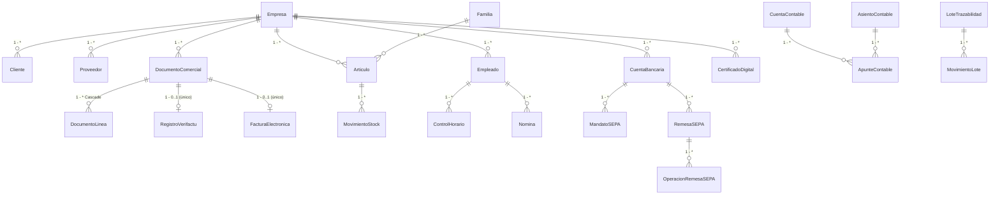

# Estructura de Base de Datos — ERP .NET

> **DbContext:** `ERP.Data/ApplicationDbContext.cs:15` (`IdentityDbContext<ApplicationUser>`)
> **Snapshot EF Core:** `ERP.Data/Migrations/ApplicationDbContextModelSnapshot.cs:15` — ProductVersion `9.0.19`
> **Migraciones:** `20260903112212_InitialCreate`, `20260903115124_Compliance2026`
> **Generado:** 2026-09-09

---

## 1. Arquitectura y Motor

| Aspecto | Detalle |
|---|---|
| **ORM** | Entity Framework Core 9.0.19 |
| **Proveedor principal** | SQLite (`Data Source=erp.db` en `ERP.Api/appsettings.json:4`, `erp-fresh.db` en `ERP.Api/appsettings.Development.json:10`) |
| **Proveedor alternativo** | SQL Server — toggle `Database:UseSqlite` (`ERP.Api/Program.cs:22,51`) |
| **Multi-tenant** | `erp.db` maestro (registro central de TODOS los usuarios/empresas) + clon `Gestion{Empresa}.db` por empresa. Resolución por claim `Tenant` en `ERP.Api/Program.cs:25-41` vía `ERP.Services/Tenant/TenantDatabaseService.cs`. `erp.db` contiene todos los `AspNetUsers` duplicados en cada `GestionX.db` (`TenantDatabaseService.cs:184`) |
| **Login** | Siempre contra `erp.db` (sin claim `Tenant` aún). `AuthController.cs:47,89` busca en maestro y resuelve `Tenant` file `Gestion{SanitizeEmpresa}.db` para el JWT (`AuthController.cs:92`) |
| **Aislamiento** | Cada request con `Tenant` usa su `GestionX.db`; sin `Tenant` (pasillo `admin@erp.local` `EmpresaId=0`) usa maestro virgen. `EmpresasController.cs:39` filtra `EmpresaId==0 → []` |
| **Logout virgen** | `AuthService.Logout()` borra `authToken` + `erp_empresas_active_id` + `erp_onboarding_dismissed` + `erp_*` + `sessionStorage` (`ERP.Web/Services/AuthService.cs:88`), `EmpresaService.ClearAsync()` (`ERP.Web/Services/EmpresaService.cs:113`) y `NotificationService.ClearHistory()`. Navegación `forceLoad:true` destruye circuito Blazor (`Header.razor:130`, `NavMenu.razor:454`, `OnboardingWizard.razor:220`) para que el pasillo reaparezca virgen |
| **Onboarding virgen** | `OnboardingWizard.razor:124` detecta `OnboardingRequired`/`EmpresaId==0` y fuerza paso 1 vacío sin precargar `primeraEmpresa` de `onboarding-check` |
| **Migración al arranque** | `context.Database.MigrateAsync()` con fallback `EnsureCreatedAsync()` (`ERP.Api/Program.cs:180`) |
| **Precisión decimal global** | `decimal(18,4)` para todo `decimal`/`decimal?` (`ERP.Data/ApplicationDbContext.cs:97-107`) |
| **Filtros globales (soft-delete)** | `Cliente.IsActivo`, `Articulo.IsDescatalogado`, `Empleado.FechaBaja`, `Proveedor.IsActivo`, `Acreedor.IsActivo`, `Familia.IsActiva` (`ApplicationDbContext.cs:88-94`) |
| **Seed bootstrap** | Usuario `admin@erp.local` / `Admin123!` sin `EmpresaId`, rol `Admin` + todos los `AppPermissions` (`ERP.Api/Program.cs:197-232`) |

---

## 2. Tablas Identity (ASP.NET Core Identity)

Hereda de `IdentityDbContext<ApplicationUser>` (`ERP.Data/ApplicationDbContext.cs:15`).

| Tabla | Clave | Columnas relevantes |
|---|---|---|
| **AspNetUsers** (`ApplicationUser`) | `Id` TEXT | `UserName`, `NormalizedUserName` (UNIQUE), `Email`, `NormalizedEmail`, `PasswordHash`, `FullName*`, `EmpresaId` FK→`Empresas` `Restrict` (`ApplicationDbContext.cs:145`), `IsActivo`, `UltimoAcceso`, `LockoutEnabled`, `AccessFailedCount` |
| **AspNetRoles** | `Id` TEXT | `Name`, `NormalizedName` |
| **AspNetUserRoles** | `UserId+RoleId` | — |
| **AspNetUserClaims** | `Id` | `ClaimType="Permission"` / `ClaimValue=AppPermissions.All` (`ERP.Api/Program.cs:96-102`) |
| **AspNetRoleClaims**, **AspNetUserTokens**, **AspNetUserLogins** | — | Estándar Identity |

> `*FullName` es `Required` en `ApplicationUser`.

---

## 3. Núcleo ERP

### 3.1 Empresas
`ERP.Domain/Entities/Empresa.cs:8` → tabla `Empresas` (`ApplicationDbContext.cs:22`)

| Columna | Tipo | Notas |
|---|---|---|
| `Id` | INTEGER PK | Identity |
| `NombreComercial` | TEXT(100) Required | |
| `RazonSocial` | TEXT(150) Required | |
| `CIF` | TEXT(20) Required | |
| `Direccion`, `CodigoPostal`, `Poblacion`, `Provincia` | TEXT | |
| `Email`, `Telefono`, `Web` | TEXT | |
| `RegistroMercantil` | TEXT | |
| `LogoUrl`, `LogoBase64`, `ColorHex="#3498db"`, `Eslogan` | TEXT | Visual |
| `SerieFacturacion="2026"` Required, `UltimoNumeroFactura`, `IvaDefecto 21` decimal(18,4) | | Negocio |
| `IsActiva` | INTEGER bool | |
| `ModalidadVerifactu` enum, `FechaAltaVerifactu`, `CertificadoVerifactuId` FK→`CertificadosDigitales` `Restrict` (`ApplicationDbContext.cs:297`) | Veri*Factu RD 1007/2023 |
| `NombreSistemaInformatico="ERP.NET"`(100), `VersionSistemaInformatico="1.0.0"`(20), `IdSistemaInformatico`(100), `NumeroInstalacion`(20) | SIF |
| `TerritorioFiscal` enum (Península/Canarias/CeutaMelilla), `EsSII` bool | IVA territorial |
| `FechaAlta`, `UltimaModificacion` | Auditoría |

### 3.2 Terceros
| Tabla | PK | FK Empresa | Campos clave | Filtro |
|---|---|---|---|---|
| **Clientes** (`Cliente.cs`) | Id | `EmpresaId` | `CodigoCliente`(20) Req, `RazonSocial`(150) Req, `CIF`(20) Req, `NIF_UE`(20), `PaisISO`(2), `Direccion/Poblacion/Provincia/CodigoPostal`, `Email/Telefono`, `FormaPago`, `DescuentoFijo` decimal(18,2), `DiaPagoHabitual`, `EsAdministracionPublica`+`DIR3_OficinaContable/OrganoGestor/UnidadTramitadora`(20), `IsActivo`, `IsBloqueado/MotivoBloqueo`, `TieneRecargoEquivalencia` | `IsActivo` |
| **Proveedores** | Id | — | `RazonSocial`(150) Req, `CIF`(20) Req, `NombreContacto`(100), `Telefono`(20), `Email`(150), `EsAcreedor` bool, `FechaAlta`, `IsActivo` | `IsActivo` |
| **Acreedores** | Id | — | Similar a Proveedor + `IsActivo` | `IsActivo` |

### 3.3 Catálogo
| Tabla | PK | FKs | Campos |
|---|---|---|---|
| **Familia** (`Familia.cs`) | Id | — | `Nombre`(100) Req, `CodigoInterno`(10), `Descripcion`(255), `IsActiva`, `FechaCreacion/UltimaModificacion`. `ToTable("Familia")` `ApplicationDbContext.cs:94` |
| **Articulos** (`Articulo.cs`) | Id | `FamiliaId` FK→Familia `Restrict` (`ApplicationDbContext.cs:151`), `ProveedorHabitualId`, `EmpresaId` | `Codigo`(50) Req, `Descripcion`(200) Req, `FamiliaId`, `PrecioCompra/Venta` decimal(18,4), `Stock/StockMinimo/StockReservado` decimal(18,4), `PorcentajeIva` decimal(18,2), `IsDescatalogado`, `ImagenUrl` |

### 3.4 Configuración
| Tabla | PK | Campos |
|---|---|---|
| **ConfiguracionesGenerales** | `Clave` TEXT PK | `Valor` TEXT Req, `Descripcion`, `UltimaModificacion` |

---

## 4. Documentos Comerciales y Tesorería Documental

### 4.1 Documentos
`ERP.Domain/Entities/DocumentoComercial.cs:8` → `Documentos` (`ApplicationDbContext.cs:31`)

| Columna | Tipo | Notas |
|---|---|---|
| `Id` | INTEGER PK | |
| `Tipo` | INTEGER enum `TipoDocumento` | Factura, Albarán, Presupuesto, Pedido, Rectificativa... |
| `EsCompra` | bool | false=Venta |
| `NumeroDocumento` | TEXT(50) Req | Índice **único** `EmpresaId+NumeroDocumento` (`ApplicationDbContext.cs:176`) |
| `NumeroAlbaran` | TEXT(100) | |
| `NumeroFacturaProveedor` | TEXT | |
| `Fecha`, `FechaRecepcion` | TEXT | |
| `EmpresaId` | INTEGER FK | |
| `ClienteId` FK→Clientes `Restrict` (`ApplicationDbContext.cs:163`), `ProveedorId` FK→Proveedores `Restrict` (`ApplicationDbContext.cs:169`), `DocumentoOrigenId` |  |
| `BaseImponible`, `TotalIva`, `Total` | decimal(18,4) | |
| `IsContabilizado` | bool | |
| `IncidenciaVerifactu`, `EsFacturaSimplificada`, `EsFacturaSinIdentifDestinatario`, `TipoRectificativa`(2) I/S, `FacturasRectificadasJson` | Veri*Factu |
| `EnviadaCliente`, `FechaEnvioCliente`, `PresentadaHacienda`, `FechaPresentacionHacienda`, `EstaEmitidaFormalmente` (NotMapped) | Trazabilidad fiscal |
| `Estado` enum `EstadoDocumento` (Borrador...) | |
| `MetodoPago="Efectivo"`, `Observaciones`, `NotasInternas`, `UsuarioNombre`(100) | |

### 4.2 Líneas y Vencimientos
| Tabla | PK | FK | Campos |
|---|---|---|---|
| **DocumentoLineas** (`DocumentoLinea.cs`) | Id | `DocumentoId` FK→Documentos `Cascade` (`ApplicationDbContext.cs:186`), `ArticuloId` FK→Articulos `SetNull/Restrict` (`ApplicationDbContext.cs:112`) | `DescripcionArticulo` Req, `Cantidad` decimal(18,4), `PrecioUnitario` decimal(18,4), `PorcentajeIva/RecargoEquivalencia/RetencionIRPF` decimal(5,2), `TipoIvaCatalogo` enum, `CategoriaNombre`(100) |
| **Vencimientos** (`Vencimiento.cs`) | Id | `EmpresaId` FK `NoAction` (`ApplicationDbContext.cs:157`) | `DocumentoId`, `FechaVencimiento`, `Importe`, `Estado`, `MetodoPago` |
| **CierresCaja** (`CierreCaja.cs`) | Id | `EmpresaId` FK `Restrict` (`ApplicationDbContext.cs:192`) | `FechaCierre`, `Terminal`(50) Req, `TotalVentasEfectivo/Tarjeta`, `Base4/10/21`, `Iva4/10/21`, `TotalIva`, `ImporteRealEnCaja` decimal(18,4), `IsProcesado`, `DataUsuariosJson/CategoriasJson`, `Observaciones` |
| **MovimientosStock** | Id | `ArticuloId` FK `Restrict` (`ApplicationDbContext.cs:136`) | `Fecha`, `Tipo`, `Cantidad`, `StockResultante`, `DocumentoOrigen` |
| **GastoCaja** | Id | — | Gastos menores caja |

---

## 5. Veri*Factu y Facturación Electrónica

| Tabla | PK | Índice/FK | Descripción |
|---|---|---|---|
| **RegistrosVerifactu** (`RegistroVerifactu.cs`) | Id | `DocumentoId` **UNIQUE** (`ApplicationDbContext.cs:179`), `EmpresaId+FechaHoraHusoGeneracion` idx (`ApplicationDbContext.cs:184`) | Registro alta Veri*Factu: `Hash`, `Encadenamiento`, `QR`, `XML`, `EstadoAEAT` |
| **RegistrosVerifactuAnulacion** | Id | `RegistroAltaId` **UNIQUE** FK→RegistrosVerifactu `Restrict` (`ApplicationDbContext.cs:265`) | Anulación |
| **FacturasElectronicas** (`FacturaElectronica.cs`) | Id | `DocumentoId` **UNIQUE** FK `Restrict` (`ApplicationDbContext.cs:275`), `EmpresaId` FK `Restrict` (`ApplicationDbContext.cs:283`) | `NumeroExpedicion`(50) Req, `Serie`(20) Req, `Formato` enum (Facturae 3.2), `Version`(10) Req, `CodMoneda`(3), `Estado` enum, `PuntoEntrada` (FACe/B2B), `DIR3_*`(20), `NIFCliente`(20), `NombreCliente`(120), `XmlBase64`, `FirmaXAdESBase64`, `HashSha256`(64), `CodigoRegistroFACe`, `FechaCreacion/Registro/LimitePago`, `CertificadoId` |

Empresa amplía Veri*Factu: `ModalidadVerifactu`, `IdSistemaInformatico`, `NumeroInstalacion` (`Empresa.cs:54-67`).

---

## 6. RRHH y Control Horario

| Tabla | PK | FK | Campos clave |
|---|---|---|---|
| **Empleados** (`Empleado.cs`) | Id | `EmpresaId` | `Nombre`(100) Req, `Apellidos`(100) Req, `NombreCompleto`(150) Req, `DNI`(20) Req, `NumeroSeguridadSocial` Req, `NumeroAfiliacionNAF`(12), `CCC`(20) Req, `IBAN`(34), `CodigoCuentaCotizacion`(20), `GrupoCotizacion` enum, `TipoContrato`(20), `ConvenioColectivo`(50), `CNAE`(20), `FechaAlta/Baja/Antiguedad`, `Departamento/Cargo`, `Email/Telefono`, `SalarioBrutoAnual/BaseMensual` decimal(18,4), `VacacionesTotales/Disfrutadas`, `PinAcceso`(10) Req, `RutaDocumentoPdf` |
| **ControlesHorarios** (`ControlHorario.cs`) | Id | `EmpleadoId` FK→Empleados `Restrict` (`ApplicationDbContext.cs:119`) | `Entrada`, `Salida`, `HorasTotales` decimal(18,4), `TipoRegistro/Modalidad/Estado/Origen` enums, `JornadaCompleta`, `Geolocalizacion`(100), `DireccionIP`(45), `DispositivoId`(100), `Hash`(64) Req + `HashAnterior`(64) (cadena inmutable), `FirmaEmpleadoBase64/FirmaValidada`, `Ubicacion`, `MotivoCorreccion`(500), `UsuarioCorreccion`(100), `FechaCorreccion/FinConservacion` |
| **PoliticasControlHorario** (`PoliticaControlHorario.cs`) | Id | `EmpresaId` **UNIQUE** FK `Restrict` (`ApplicationDbContext.cs:255,261`) | Política por empresa |
| **Nominas** (`Nomina.cs`) | Id | `EmpleadoId` FK `Restrict` (`ApplicationDbContext.cs:127`), `RemesaSEPAId` FK `Restrict` (`ApplicationDbContext.cs:290`) | `Periodo`, `Bruto/Neto`, `IRPF`, `SegSocial`, `Estado`, `RemesaSEPAId` (pago por SEPA) |
| **LiquidacionesSeguridadSocial** | Id | — | RGPD + Seg. Social |
| **Tareas** (`Tarea.cs`) | Id | — | `Titulo`, `Estado`, `Prioridad` |
| **Llamadas** (`Llamada.cs`) | Id | — | Registro llamadas |

---

## 7. Contabilidad (PGC 2008)

| Tabla | PK | FKs | Notas |
|---|---|---|---|
| **CuentasContables** (`Contabilidad/CuentaContable.cs`) | `Codigo` TEXT(9) PK | `CodigoPadre` self-FK, `EmpresaId` | `Nombre`(150) Req, `Descripcion`(500), `Nivel`, `Grupo` enum, `Naturaleza` (Deudora/Acreedora), `EsDetalle`, `EsPGCOficial`, `Activa`, `FechaCreacion/Modificacion` |
| **AsientosContables** (`Contabilidad/AsientoContable.cs`) | Id | `EmpresaId`, `LibroDiarioId` FK nullable | `Numero`, `Serie`(20) Req, `Fecha`, `Concepto`(500) Req, `Tipo`/`Estado` enums, `TotalDebe/Haber` decimal(18,4), `OrigenTipo/OrigenId` (polimórfico), `FechaCreacion/Modificacion/Contabilizacion`, `UsuarioCreacion/Modificacion/Contabilizacion`(100) |
| **ApuntesContables** | Id | `AsientoId` FK→Asientos, `CuentaContableCodigo` FK→CuentasContables(9) | `Concepto`(500), `Importe` decimal(18,4), `Tipo` Debe/Haber, `Orden`, `DocumentoReferencia`, `CentroCosteId/ProyectoId`, `UsuarioCreacion`(100) |
| **EjerciciosContables** | Id | `EmpresaId` | `Codigo`(10) Req, `FechaInicio/Fin`, `FechaInicioActividad`, `Estado` enum, `CierreTrimestral1-4`, `CierreDefinitivo`, `LibrosLegalizados/FechaLegalizacion`, `CuentasDepositadas/FechaDepositoCuentas/NumeroDeposito`(100), `FechaCierre` |
| **LibrosDiario** (`Contabilidad/LibrosOficiales.cs`) | Id | `EjercicioId`, `EmpresaId` | `NumeroLibro`(30) Req, `FechaDesde/Hasta/Generacion`, `NumeroAsientos/Apuntes`, `TotalDebe/Haber` decimal(18,4), `Estado`, `HashArchivo`(500), `FirmaXAdESBase64`(64), `FechaLegalizacion/PresentacionRM`, `NumeroLegalizacion`(100) |
| **LibrosMayor** | Id | `EjercicioId`, `EmpresaId`, `CuentaContableCodigo`(9) | `SaldoInicialDebe/Haber`, `TotalDebe/Haber`, `SaldoFinalDebe/Haber` decimal(18,4), `FechaActualizacion` |
| **LibrosInventariosCuentasAnuales** | Id | `EjercicioId`, `EmpresaId` | `BalanceInicial/Situacion`, `CuentaPerdidasGanancias`, `EstadoCambiosPatrimonioNeto`, `EstadoFlujosEfectivo`, `InventarioCierre`, `Memoria`, `BalancesComprobacionTrimestrales` (JSON), `EsAbreviado`, `Estado`, `HashArchivo`(500) |

---

## 8. Bancario / SEPA (pain.001 / pain.008 / camt.053)

| Tabla | PK | FKs | Campos |
|---|---|---|---|
| **CuentasBancarias** (`Bancario/CuentaBancaria.cs`) | Id | `EmpresaId` | `NombreCuenta`(100) Req, `IBAN`(34) Req, `BIC`(11), `EntidadBancaria`(100), `CodigoEntidad`(4)/`CodigoOficina`(4)/`DigitosControl`(2)/`NumeroCuenta`(10), `Tipo` enum, `Activa`, `EsPrincipal`, `PermiteAdeudosSEPA/TransferenciasSEPA/Instant`, `LimiteDiarioAdeudos/Transferencias` decimal(18,2), `CreditorIdentifier`(35), `FechaCreacion/Modificacion` |
| **MandatosSEPA** (`Bancario/MandatoSEPA.cs`) | Id | `EmpresaId`, `ClienteId`/`ProveedorId` nullable, `CuentaBancariaAcreedorId` FK `Restrict` (`ApplicationDbContext.cs:199`), `CuentaBancariaDeudorId` FK `Restrict` (`ApplicationDbContext.cs:205`) | `ReferenciaUnicaMandato`(35) Req, `Esquema` enum (CORE/B2B/COR1), `TipoSecuencia` (FRST/RCUR/FNAL/OOFF), `Estado` enum, `CreditorIdentifier`(35) Req, `AcreedorNombre`(140) Req/`AcreedorIBAN`(34) Req/`AcreedorBIC`(11)/`Acreedor*` dirección, `DeudorNombre`(140) Req/`DeudorIBAN`(34) Req/`DeudorBIC`(11)/`Deudor*` dirección, `FechaFirma/Creacion/Modificacion/PrimeraPresentacion/UltimaPresentacion`, `BeneficiarioVerificado/FechaVerificacion/MetodoVerificacion` |
| **RemesasSEPA** (`Bancario/RemesaSEPA.cs`) | Id | `EmpresaId`, `CuentaBancariaOrdenanteId` FK `Restrict` (`ApplicationDbContext.cs:212`), `CuentaBancariaAcreedoraId` FK `Restrict` (`ApplicationDbContext.cs:218`), `MandatoSEPAId` nullable | `Referencia`(20) Req, `Tipo` (Adeudos/Transferencias), `Esquema`, `Estado` enum, `ImporteTotal` decimal(18,2), `NumeroOperaciones`, `FechaCreacion/Ejecucion/EnvioBanco/Conciliacion/Modificacion`, `XmlGenerado` TEXT, `HashXmlSHA256`, `NombreArchivoXml`, `TamanoBytes`, `ReferenciaBanco/RespuestaBanco`, `Conciliada`, `UsuarioCreacion/Envio/Conciliacion`(100) |
| **OperacionesRemesaSEPA** | Id | `RemesaId` FK, `MandatoId` FK nullable | `Orden`, `Importe` decimal(18,2), `Moneda`(3) Req, `Concepto`(140), `BeneficiarioNombre`(140)/`BeneficiarioIBAN`(34)/`BeneficiarioBIC`(11) + dirección, `DeudorNombre/IBAN/BIC`, `ReferenciaUnicaMandato`(35), `TipoSecuencia`, `Estado`, `ReferenciaPropia`(140), `OrigenTipo/OrigenId` (Factura/Nómina), `EsDevolucion/FechaDevolucion/CodigoDevolucion`, `CodigoRespuestaBanco` |
| **ExtractosBancarios** | Id | `CuentaBancariaId` FK | `ReferenciaExtracto`(35) Req, `FechaExtracto/Valor/Recepcion/Procesado`, `SaldoInicial/Final` decimal(18,2), `TotalCargos/Abonos` decimal(18,2), `Procesado`, `XmlOriginal`, `HashXmlSHA256`, `camt.053` |
| **MovimientosExtracto** | Id | `ExtractoId` FK | `Secuencia`, `FechaValor/Contable/Creacion/Conciliacion`, `Importe` decimal(18,2), `Moneda`(3) Req, `Tipo` enum, `Concepto`(140), `ContrapartidaNombre`(140)/`IBAN`(34), `EndToEndId`(35), `MandateId`(35), `ReferenciaBanco`(35), `Conciliado`, `OperacionRemesaId`, `FacturaId`, `AsientoContableId` |

---

## 9. Trazabilidad Alimentaria

`ERP.Domain/Entities/Trazabilidad/TrazabilidadEntities.cs` → `ERP.Data/ApplicationDbContext.cs:61-65`

| Tabla | PK | FKs | Campos |
|---|---|---|---|
| **LotesTrazabilidad** | Id | `EmpresaId`, `ArticuloId` | `CodigoLote`, `FechaFabricacion/Caducidad`, `Cantidad`, `Estado` |
| **MovimientosLote** | Id | `LoteId` FK→Lotes `MovimientosEntrada` `Restrict` (`ApplicationDbContext.cs:224`), `LoteOrigenId` FK→Lotes `MovimientosSalida` `Restrict` (`ApplicationDbContext.cs:230`), `LoteResultadoId` FK `Restrict` (`ApplicationDbContext.cs:236`) | Trazabilidad hacia atrás/adelante, transformaciones |
| **AlertasTrazabilidad** | Id | `LoteId` FK→Lotes `Alertas` `Restrict` (`ApplicationDbContext.cs:242`) | `Tipo`, `Gravedad`, `Mensaje` |
| **RetiradasLote** | Id | `LoteId` FK→Lotes `Retiradas` `Restrict` (`ApplicationDbContext.cs:248`) | Retirada de mercado |

---

## 10. Fiscal IVA (Dossier §3-9)

`ERP.Domain/Entities/Fiscal/IVAEntities.cs` + `TarifaImpuesto.cs` → `ApplicationDbContext.cs:67-72`

| Tabla | PK | FKs | Campos |
|---|---|---|---|
| **ConfiguracionesIVA** | Id | `EmpresaId`, `EjercicioId` | `AplicaIVACaja/FechaInicio/Fin/LimiteVolumenOperaciones` decimal(18,2), `AplicaProrrataGeneral/Especial`, `PorcentajeProrrataGeneral`(5,2), `DetalleProrrataEspecialJson`, `TieneSectoresDiferenciados/SectoresJson`, `SujetoRecargoEquivalencia`, `RecargoGeneral/Reducido/Superreducido/Tabaco` decimal(5,2), `RegimenBienesUsados/AgenciasViajes/ObjetosArte/OroInversion/ServiciosElectronicos`, `InversionSujetoPasivoHabitual`, `VersionConfig`(20) |
| **LiquidacionesIVA** | Id | `EmpresaId`, `EjercicioId` | `Año`, `Periodo` (T1-T4/M01-M12), `BaseGeneral/Reducida/Exenta/NoSujeta/InversionSujetoPasivo` decimal(18,2), `Cuota*`, `Estado`, `FechaPresentacion`, `Modelo` (303/390) |
| **DetallesLiquidacionIVA** | Id | `LiquidacionIVAId` FK, `SectorDiferenciadoIVAId` FK nullable | `BaseImponible` decimal(18,2), `TipoImpositivo` decimal(5,2), `CuotaIVA/CuotaDeducible` decimal(18,2), `TipoIVA/TipoOperacion` enums, `EsDeducible`, `InversionSujetoPasivo`, `FechaOperacion`, `NumeroDocumento`(50) |
| **SectoresDiferenciadosIVA** | Id | — | Sectores prorrata especial |
| **TarifasImpuesto** | Id | — | `Codigo`, `Porcentaje` |
| **LibrosRegistroIVA** | Id | `EmpresaId`, `EjercicioId` | `TipoLibro` (Emitidas/Recibidas/BienesInversión/Intracomunitarias), `NumeroFactura`, `NIFContraparte/NombreContraparte`, `BaseImponible` decimal(18,2), `TipoImpositivo` decimal(5,2), `CuotaIVA/CuotaRecargo` decimal(18,2), `ClaveOperacion`, `EsDeducible`, `FechaOperacion` |

---

## 11. Firma Digital, Sellado de Tiempo y RGPD

`ERP.Domain/Entities/FirmaDigital/FirmaDigitalEntities.cs` + `RGPD/RegistroTratamiento.cs` → `ApplicationDbContext.cs:74-81`

| Tabla | PK | FK | Campos |
|---|---|---|---|
| **CertificadosDigitales** | Id | `EmpresaId` | `Nombre`(100) Req, `Tipo`/`Uso`/`Almacenamiento`/`Estado` enums, `SubjectDN/IssuerDN`(200) Req, `SerialNumber`(40) Req, `ThumbprintSHA1`(40) Req/`SHA256`(64) Req, `NotBefore/After`, `PublicKeyPem` Req, `CadenaCertificadosPem`, `AlgoritmoClave/Firma`(50) Req, `TamanoClave`, `CRLUrl/OCSPUrl`(200), `QTSP`(100), `NumeroAutorizacionQTSP`(100), `PoliticaFirmaOID`(100), `Revocado/FechaRevoca/MotivoRevoca` |
| **FirmasElectronicas** | Id | `EmpresaId`, `CertificadoId` FK | `DocumentoTipo`(100) Req/`DocumentoId`/`DocumentoReferencia`(100), `Tipo`/`Formato`/`EstadoVerificacion` enums, `FirmanteNombre`(200) Req/`FirmanteNIF`(20) Req/`FirmanteEmail/Cargo`(100), `FirmaBase64` Req, `FirmaEstructurada` Req, `HashDocumentoSHA256`(64) Req/`SHA1`(40), `PoliticaFirmaOID`, `ArchivoFirmadoBase64/NombreArchivoFirmado`(100), `FechaFirma/Creacion/UltimaVerificacion`, `DetalleVerificacion`(500), `DireccionIP`(45), `UserAgent`(200), `Geolocalizacion`(100), `TSPUrl`(200), `TimestampTokenBase64` |
| **SolicitudesFirma** | Id | `EmpresaId`, `FirmaElectronicaId` FK nullable | `Referencia`(100) Req, `Titulo`(200) Req, `Descripcion`(500), `NombreArchivo`(100) Req, `DocumentoBase64` Req, `HashDocumentoSHA256`(64) Req, `FirmantesJson` Req, `TipoFirmaRequerida`, `FormatoSalida`, `Estado`, `FechaCreacion/Expiracion/UltimoRecordatorio`, `RecordatoriosEnviados` |
| **SellosTiempo** | Id | `EmpresaId` | `TSAName`(100) Req, `TSAUrl`(200) Req, `ReferenciaDocumento`(100), `HashDatosSHA256`(64) Req, `TokenBase64` Req, `FechaTimestamp/Generacion/Creacion`, `TSACertThumbprint`(64), `PoliticaTSA_OID` |
| **ComunicacionesCertificadas** | Id | `EmpresaId` | `Referencia`(100) Req, `Asunto`(200) Req, `Contenido` Req, `RemitenteNombre`(200) Req/`RemitenteEmail`(100) Req, `DestinatariosJson` Req, `AdjuntosJson` Req, `Estado` enum, `FechaEnvio/Entrega/AcuseRecibo/LimiteEntrega/Creacion`, `RequiereAcuseRecibo/EntregaPersonal`, `PruebaEntrega/Contenido` Base64 |
| **RegistrosTratamiento** (RGPD art.30) | Id | `EmpresaId` | `Nombre`, `Finalidad`, `BaseJuridica`, `CategoriasInteresados/Datos`, `Destinatarios`, `PlazoConservacion`, `MedidasSeguridad` |
| **LiquidacionesSeguridadSocial** | Id | — | TC1/TC2 |

---

## 12. Índices y Restricciones Relevantes

* `Documentos` — `UNIQUE(EmpresaId, NumeroDocumento)` (`ApplicationDbContext.cs:176`)
* `RegistrosVerifactu` — `UNIQUE(DocumentoId)` (`ApplicationDbContext.cs:180`), `INDEX(EmpresaId, FechaHoraHusoGeneracion)` (`ApplicationDbContext.cs:184`)
* `RegistrosVerifactuAnulacion` — `UNIQUE(RegistroAltaId)` (`ApplicationDbContext.cs:271`)
* `FacturasElectronicas` — `UNIQUE(DocumentoId)` (`ApplicationDbContext.cs:281`)
* `PoliticasControlHorario` — `UNIQUE(EmpresaId)` (`ApplicationDbContext.cs:261`)
* `Nominas.RemesaSEPAId` — `Restrict` (`ApplicationDbContext.cs:290`)
* `Empresa.CertificadoVerifactuId` — `Restrict` (`ApplicationDbContext.cs:297`)
* Todas las FK `Articulo/Empleado/Nomina/MovimientoStock` → `Restrict` (`ApplicationDbContext.cs:112-141`) para evitar borrados en cascada no deseados; `DocumentoLinea` → `Documento` `Cascade`.

---

## 13. Ficheros Fuente

* `ERP.Data/ApplicationDbContext.cs` — DbSets y `OnModelCreating`
* `ERP.Data/Migrations/ApplicationDbContextModelSnapshot.cs` — snapshot completo
* `ERP.Domain/Entities/*.cs` + `Bancario/`, `Contabilidad/`, `Fiscal/`, `FirmaDigital/`, `Trazabilidad/`, `RGPD/`
* `ERP.Api/Program.cs` — wiring `UseSqlite`/`UseSqlServer`, JWT, `SeedService`
* `ERP.Api/appsettings*.json` — `ConnectionStrings:DefaultConnection`

> Para regenerar el diagrama SQL: `dotnet ef dbcontext script` o `dotnet ef migrations script` desde `ERP.Data`.
